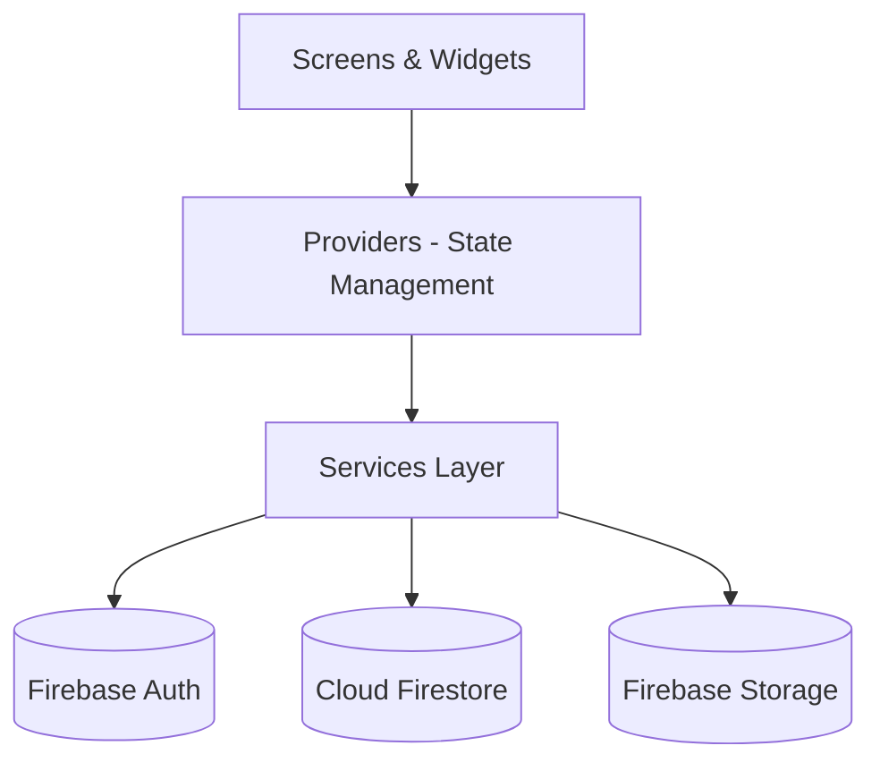
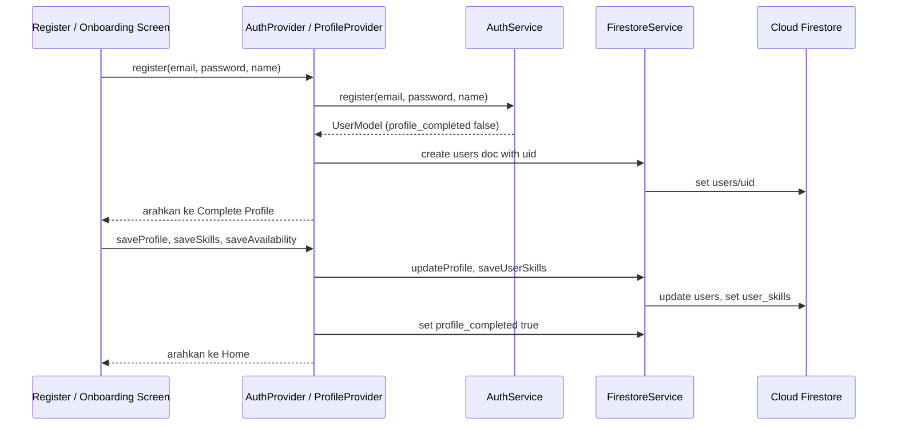
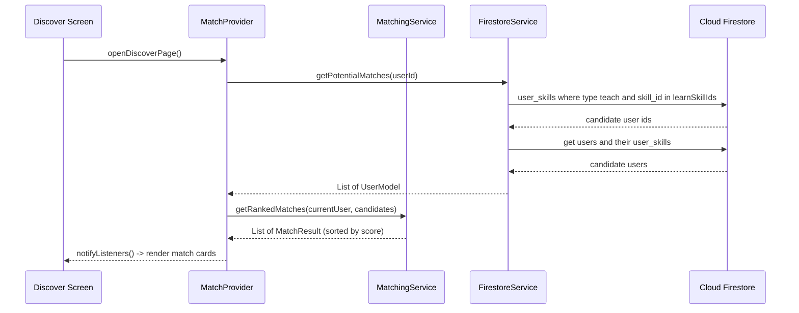
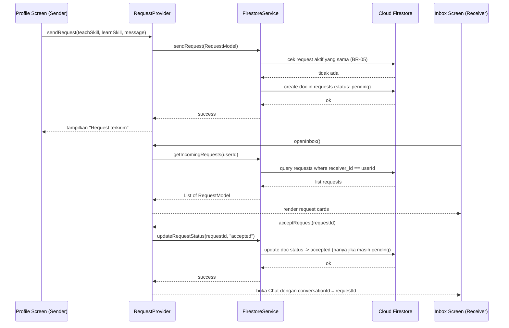
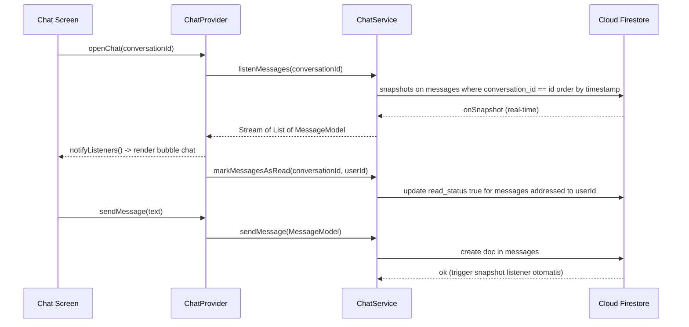
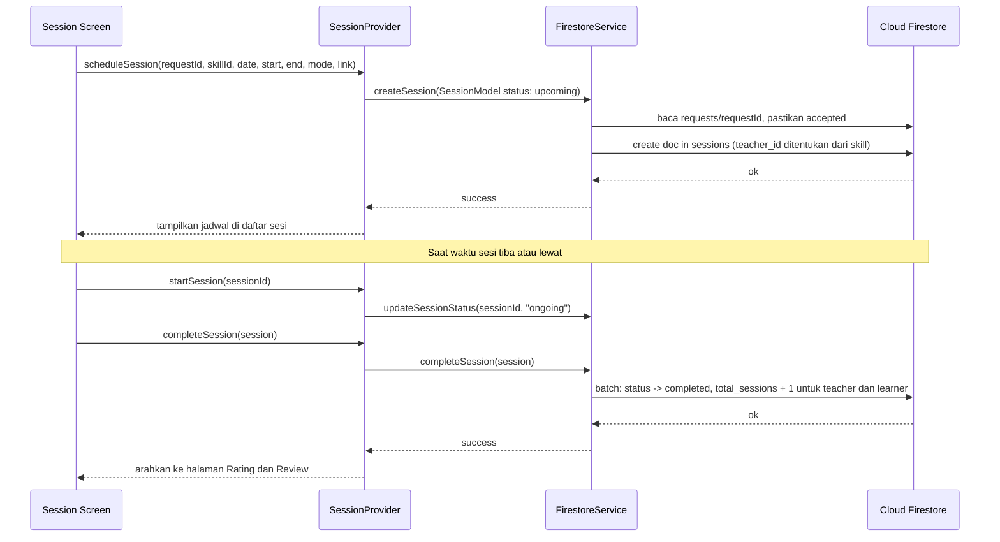
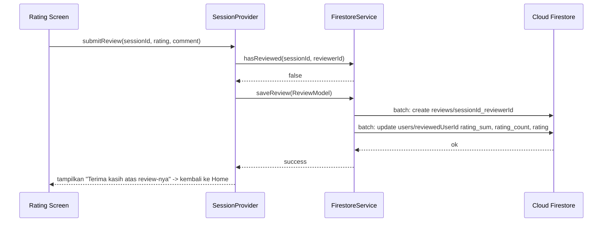
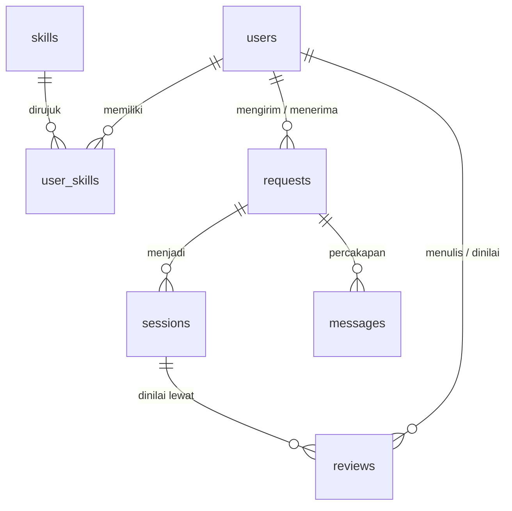
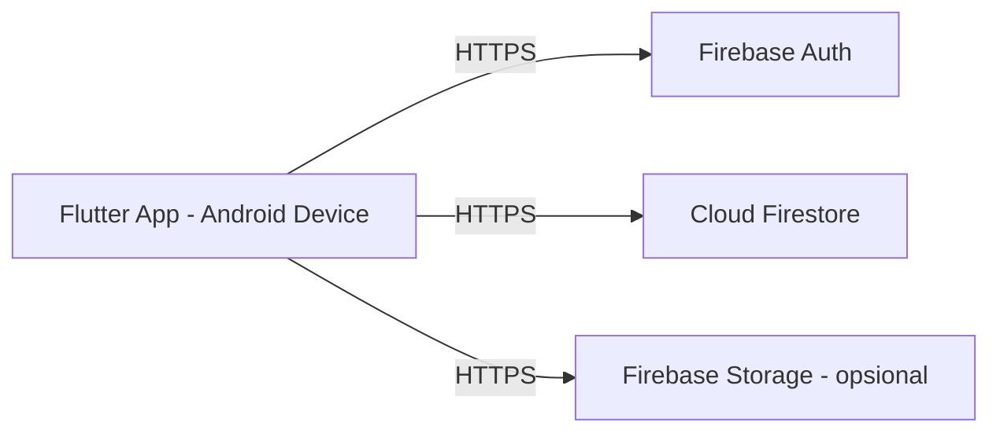

# SkillSwap — Architecture Documentation 🏗️

Dokumen ini menjelaskan arsitektur teknis aplikasi **SkillSwap**, lanjutan dari [`README.md`](README.md). Fokusnya: bagaimana layer-layer aplikasi disusun, bagaimana data mengalir, bagaimana Firebase digunakan sebagai backend, serta aturan keamanan dan pengujiannya.

> Catatan: Arsitektur ini sengaja dibuat **sederhana** (bukan full Clean Architecture dengan banyak abstraction layer) agar realistis dikerjakan dalam 12 pertemuan, sambil tetap terstruktur dan mudah dikembangkan.

> Status implementasi: fondasi Flutter, matching service, provider discover/auth, dan layar demo sudah tersedia. Firebase initialization, onboarding, Firestore service, request, chat, sesi, dan review masih dikerjakan bertahap sesuai urutan MVP.

## Daftar Isi

1. [Prinsip Arsitektur](#1-prinsip-arsitektur)
2. [Layer Aplikasi](#2-layer-aplikasi)
3. [Struktur Folder (Detail)](#3-struktur-folder-detail)
4. [Tanggung Jawab Tiap Service](#4-tanggung-jawab-tiap-service)
5. [Alur Data (Sequence Diagrams)](#5-alur-data-sequence-diagrams)
6. [Firebase Architecture](#6-firebase-architecture)
7. [Implementasi Algoritma Matching](#7-implementasi-algoritma-matching)
8. [Navigasi dan Routing](#8-navigasi-dan-routing)
9. [State: Loading / Empty / Error](#9-state-loading--empty--error)
10. [Ringkasan Tech Stack](#10-ringkasan-tech-stack)
11. [Batasan Arsitektur (Sesuai Scope MVP)](#11-batasan-arsitektur-sesuai-scope-mvp)
12. [Data Contract per Service](#12-data-contract-per-service)
13. [Deployment dan Environment Topology](#13-deployment-dan-environment-topology)
14. [Strategi Error Handling](#14-strategi-error-handling)
15. [Reliability dan Offline Handling](#15-reliability-dan-offline-handling)
16. [Strategi Pengujian](#16-strategi-pengujian)
17. [Traceability Fitur ke Arsitektur](#17-traceability-fitur-ke-arsitektur)

---

## 1. Prinsip Arsitektur

* **Simple layered architecture** — bukan clean architecture penuh, tapi tetap memisahkan tanggung jawab per layer.
* **Single source of truth** — Firestore adalah sumber data utama, UI tidak pernah menyimpan state permanen sendiri.
* **Service layer sebagai jembatan** — semua komunikasi ke Firebase (Auth, Firestore, Storage) wajib lewat `services/`, tidak boleh dipanggil langsung dari UI/screen.
* **State management terpusat** — perubahan state (login, list match, chat, dsb) dikelola lewat Provider, bukan `setState` tersebar di banyak widget. `setState` hanya boleh dipakai untuk state lokal murni UI (misalnya toggle visibilitas kata sandi).
* **Keamanan di dua lapis** — validasi di service layer untuk pengalaman pengguna yang baik, dan Firestore Security Rules sebagai pertahanan terakhir yang tidak bisa dilewati dari sisi klien.

---

## 2. Layer Aplikasi

```text
┌─────────────────────────────────────────────┐
│                 PRESENTATION                │
│            screens/  +  widgets/            │
│       (UI, tidak berisi logic bisnis)       │
└──────────────────────┬──────────────────────┘
                       │ listen / call
┌──────────────────────▼──────────────────────┐
│               STATE MANAGEMENT              │
│                  providers/                 │
│  (menyimpan state, notify UI saat berubah)  │
└──────────────────────┬──────────────────────┘
                       │ call method
┌──────────────────────▼──────────────────────┐
│                SERVICE LAYER                │
│                  services/                  │
│       auth_service, firestore_service,      │
│  matching_service, storage_service, chat_   │
│                   service                   │
└──────────────────────┬──────────────────────┘
                       │ read/write
┌──────────────────────▼──────────────────────┐
│                  DATA LAYER                 │
│     Firebase Auth · Firestore · Storage     │
└─────────────────────────────────────────────┘
```

**Aturan arah dependency:** panah hanya boleh ke bawah. Screen tidak boleh import Firebase langsung, Provider tidak boleh import widget, dst. `models/` dan `core/` boleh diimpor oleh semua layer.

### Diagram (Mermaid)



> Firebase Cloud Messaging tidak ada di diagram karena notifikasi masuk daftar *Future* dan tidak diimplementasikan di MVP.

---

## 3. Struktur Folder (Detail)

```text
skillswap/
│
├── lib/
│   ├── main.dart                  # init Firebase, locale id_ID, MultiProvider
│   ├── firebase_options.dart      # hasil flutterfire configure
│   │
│   ├── core/
│   │   ├── constants/             # warna, ukuran, app_strings.dart, availability_slots.dart
│   │   ├── errors/                # app_exception.dart
│   │   ├── theme/                 # ThemeData Flutter (Material 3)
│   │   └── utils/                 # validators.dart, date_formatter.dart
│   │
│   ├── models/
│   │   ├── user_model.dart
│   │   ├── skill_model.dart
│   │   ├── user_skill_model.dart
│   │   ├── request_model.dart
│   │   ├── session_model.dart
│   │   ├── message_model.dart
│   │   ├── review_model.dart
│   │   ├── match_result.dart
│   │   └── view_state.dart
│   │
│   ├── services/
│   │   ├── auth_service.dart
│   │   ├── firestore_service.dart
│   │   ├── matching_service.dart
│   │   ├── storage_service.dart
│   │   └── chat_service.dart
│   │
│   ├── providers/
│   │   ├── auth_provider.dart
│   │   ├── profile_provider.dart  # profil, skill, availability
│   │   ├── discover_provider.dart # pencarian skill dan kategori
│   │   ├── match_provider.dart    # rekomendasi matching
│   │   ├── request_provider.dart
│   │   ├── chat_provider.dart
│   │   └── session_provider.dart  # sesi dan review
│   │
│   ├── screens/
│   │   ├── auth/         # splash, login, register
│   │   ├── onboarding/   # complete profile, select skill, availability
│   │   ├── home/
│   │   ├── discover/     # tab rekomendasi, tab cari skill, profil pengguna lain
│   │   ├── request/      # kirim request, kotak request (masuk / terkirim)
│   │   ├── chat/         # daftar chat, ruang chat
│   │   ├── session/      # daftar, jadwalkan, detail, rating
│   │   └── profile/      # profil saya, edit profil
│   │
│   ├── widgets/
│   │   ├── skill_card.dart
│   │   ├── skill_chip.dart
│   │   ├── match_card.dart
│   │   ├── session_card.dart
│   │   ├── rating_widget.dart
│   │   ├── chat_bubble.dart
│   │   ├── status_badge.dart
│   │   ├── profile_avatar.dart
│   │   ├── confirm_dialog.dart
│   │   ├── empty_state.dart
│   │   ├── loading_state.dart
│   │   ├── error_state.dart
│   │   └── custom_button.dart
│   │
│   └── routes/
│       └── app_routes.dart
│
├── test/
│   ├── services/matching_service_test.dart
│   ├── utils/validators_test.dart
│   └── models/status_transition_test.dart
│
├── tools/
│   └── seed/                      # skrip seed Node.js + firebase-admin
│       ├── package.json
│       ├── seed.js
│       ├── skills.json
│       └── demo_users.json
│
├── firestore.rules
├── firestore.indexes.json
├── storage.rules                  # hanya jika memakai Firebase Storage
├── firebase.json
├── Architecture.md
└── README.md
```

**Kenapa ada `providers/` terpisah dari `services/`?**
`services/` fokus pada *bagaimana* mengambil/menyimpan data (Firebase calls). `providers/` fokus pada *state apa* yang dipegang UI saat ini (loading, data, error) dan kapan UI perlu rebuild.

---

## 4. Tanggung Jawab Tiap Service

| Service | Tanggung Jawab |
|---|---|
| `auth_service.dart` | Register, login, logout, cek status login, reset password, memetakan error Auth ke `AppException` |
| `firestore_service.dart` | CRUD dan query untuk users, skills, user_skills, requests, sessions, reviews, termasuk validasi aturan bisnis (BR) sebelum menulis |
| `matching_service.dart` | Hitung skor matching antar pengguna (murni logika, tanpa akses Firebase; lihat bagian 7) |
| `storage_service.dart` | Upload foto profil dan menghasilkan nilai untuk field `profile_picture` (lihat bagian 6.5) |
| `chat_service.dart` | Kirim pesan, listen pesan real-time, update read status |

Contoh kontrak method (bukan implementasi final, sekadar acuan struktur):

```dart
// auth_service.dart
Future<UserModel> register(String email, String password, String name);
Future<UserModel> login(String email, String password);
Future<void> logout();
Future<void> sendPasswordReset(String email);
Stream<User?> get authStateChanges;

// firestore_service.dart — user dan skill
Future<UserModel> getUser(String userId);
Future<void> updateProfile(UserModel user);
Future<List<SkillModel>> getAllSkills();
Future<List<UserSkillModel>> getUserSkills(String userId);
Future<void> saveUserSkills(String userId, List<UserSkillModel> skills);
Future<List<UserModel>> searchUsersBySkill(String skillId, String currentUserId);
Future<List<UserModel>> getPotentialMatches(String userId);

// firestore_service.dart — request
Future<void> sendRequest(RequestModel request);
Future<List<RequestModel>> getIncomingRequests(String userId);
Future<List<RequestModel>> getSentRequests(String userId);
Future<List<RequestModel>> getAcceptedRequests(String userId);
Future<void> updateRequestStatus(String requestId, String status);

// firestore_service.dart — session dan review
Future<void> createSession(SessionModel session);
Future<List<SessionModel>> getSessions(String userId);
Future<void> updateSessionStatus(String sessionId, String status);
Future<void> completeSession(SessionModel session);
Future<void> saveReview(ReviewModel review);
Future<bool> hasReviewed(String sessionId, String reviewerId);
Future<List<ReviewModel>> getReviewsForUser(String userId);

// chat_service.dart
Stream<List<MessageModel>> listenMessages(String conversationId);
Future<void> sendMessage(MessageModel message);
Future<void> markMessagesAsRead(String conversationId, String userId);

// matching_service.dart
MatchResult buildMatch(UserModel currentUser, UserModel candidate);
double calculateMatchScore(UserModel currentUser, UserModel candidate);
List<MatchResult> getRankedMatches(UserModel currentUser, List<UserModel> candidates);

// storage_service.dart
Future<String> uploadProfilePicture(String userId, File image);
```

---

## 5. Alur Data (Sequence Diagrams)

Pola umum di semua flow: **Screen → Provider → Service → Firestore**, lalu balik lewat `notifyListeners()`. Berikut rincian untuk tiap flow utama.

### 5.1 Register dan Onboarding



### 5.2 Proses Matching



### 5.3 Proses SkillSwap Request (Kirim dan Terima)



### 5.4 Proses Chat (Real-time)



> `conversationId` adalah id dokumen `requests` yang berstatus `accepted`, jadi tidak diperlukan koleksi `conversations` terpisah.

> Chat tidak pakai polling manual — cukup `snapshots()` stream dari Firestore, jadi pesan baru otomatis muncul tanpa refresh.

### 5.5 Proses Session Scheduling dan Completion



### 5.6 Proses Rating dan Review



---

## 6. Firebase Architecture

### 6.1 Cloud Firestore — Struktur Koleksi

```text
users/{userId}
skills/{skillId}
user_skills/{userId_skillId_type}
requests/{requestId}
sessions/{sessionId}
messages/{messageId}
reviews/{sessionId_reviewerId}
```

Semua koleksi berada di **root level** (bukan nested/subcollection) supaya query lintas data (misalnya cari semua `user_skills` dengan `type: teach`) tetap mudah dengan Firestore query + index.

Relasi:



### 6.2 Skema Field

Nama field memakai `snake_case`. Tipe mengacu ke tipe Firestore.

**users/{userId}** — `userId` sama dengan UID Firebase Auth

| Field | Tipe | Keterangan |
|---|---|---|
| id | string | sama dengan document id |
| name | string | 2–50 karakter |
| email | string | |
| university | string | |
| major | string | |
| year | number | tahun angkatan |
| profile_picture | string atau null | URL foto, atau data URI pada opsi tanpa Blaze |
| availability | array of string | slot, contoh `sat_morning` |
| learning_mode | string | `online`, `offline`, `flexible` |
| rating | number | rata-rata 0–5, satu desimal |
| rating_sum | number | total seluruh rating diterima |
| rating_count | number | jumlah review diterima |
| total_sessions | number | jumlah sesi `completed` |
| profile_completed | boolean | `true` setelah onboarding selesai |
| created_at | timestamp | |

Slot availability: `{mon,tue,wed,thu,fri,sat,sun}_{morning,afternoon,evening}`, dengan `morning` 08:00–12:00, `afternoon` 12:00–17:00, `evening` 17:00–21:00.

**skills/{skillId}** — `skillId` berupa slug (contoh `python`, `ui-ux`, `html-css`)

| Field | Tipe |
|---|---|
| id, name, category, description | string |

`category` bernilai salah satu dari: `Programming`, `Design`, `Business`, `Academic`, `Language`, `Creative`, `Marketing`, `Productivity`.

**user_skills/{userId_skillId_type}**

| Field | Tipe | Keterangan |
|---|---|---|
| id | string | sama dengan document id |
| user_id | string | |
| skill_id | string | |
| type | string | `teach` atau `learn` |
| level | string | `beginner`, `intermediate`, `advanced` |

**requests/{requestId}** (auto id)

| Field | Tipe | Keterangan |
|---|---|---|
| id | string | |
| sender_id | string | |
| receiver_id | string | |
| teach_skill | string | skill_id yang diajarkan pengirim |
| learn_skill | string | skill_id yang ingin dipelajari pengirim |
| message | string | 1–300 karakter |
| status | string | `pending`, `accepted`, `declined`, `cancelled` |
| created_at | timestamp | |

**sessions/{sessionId}** (auto id)

| Field | Tipe | Keterangan |
|---|---|---|
| id | string | |
| request_id | string | request `accepted` asal sesi |
| teacher_id | string | |
| learner_id | string | |
| skill_id | string | |
| date | timestamp | tanggal sesi (jam 00:00) |
| start_time | timestamp | tanggal + jam mulai |
| end_time | timestamp | tanggal + jam selesai |
| mode | string | `online` atau `offline` |
| meeting_link | string | wajib untuk online, kosong untuk offline |
| status | string | `upcoming`, `ongoing`, `completed`, `cancelled` |
| created_at | timestamp | |

**messages/{messageId}** (auto id)

| Field | Tipe | Keterangan |
|---|---|---|
| id | string | |
| conversation_id | string | id request `accepted` |
| sender_id | string | |
| receiver_id | string | |
| message | string | 1–1000 karakter |
| timestamp | timestamp | |
| read_status | boolean | `false` saat dibuat |

**reviews/{sessionId_reviewerId}**

| Field | Tipe | Keterangan |
|---|---|---|
| id | string | sama dengan document id |
| reviewer_id | string | |
| reviewed_user_id | string | |
| session_id | string | |
| rating | number | integer 1–5 |
| comment | string | opsional, maksimal 300 karakter |
| created_at | timestamp | |

### 6.3 Strategi Keunikan dan Integritas

Firestore tidak memiliki *unique constraint*, sehingga keunikan dijaga lewat document id dan pengecekan di service:

| Kebutuhan | Cara |
|---|---|
| Satu skill hanya satu kali per tipe per pengguna | Document id `{userId}_{skillId}_{type}` |
| Skill tidak boleh di daftar `teach` dan `learn` sekaligus (BR-03) | Dicek di `saveUserSkills` sebelum menulis |
| Satu review per sesi per reviewer (BR-12) | Document id `{sessionId}_{reviewerId}`, dan rules menolak id yang berbeda |
| Tidak ada request aktif duplikat (BR-05) | Query `sender_id`, `receiver_id`, `teach_skill`, `learn_skill`, `status in [pending, accepted]` sebelum `create` |
| Request ke diri sendiri (BR-04) | Dicek di service dan di rules |
| Penulisan banyak dokumen sekaligus | `WriteBatch` untuk review + update rating, dan untuk penyelesaian sesi + `total_sessions` |
| Tidak ada penghapusan data (BR-14) | Rules menolak `delete` pada requests, sessions, messages, reviews |

### 6.4 Index yang Dibutuhkan

Query dengan `orderBy` atau kombinasi filter tertentu membutuhkan composite index. Simpan di `firestore.indexes.json`:

```json
{
  "indexes": [
    {
      "collectionGroup": "user_skills",
      "queryScope": "COLLECTION",
      "fields": [
        { "fieldPath": "skill_id", "order": "ASCENDING" },
        { "fieldPath": "type", "order": "ASCENDING" }
      ]
    },
    {
      "collectionGroup": "user_skills",
      "queryScope": "COLLECTION",
      "fields": [
        { "fieldPath": "user_id", "order": "ASCENDING" },
        { "fieldPath": "type", "order": "ASCENDING" }
      ]
    },
    {
      "collectionGroup": "requests",
      "queryScope": "COLLECTION",
      "fields": [
        { "fieldPath": "receiver_id", "order": "ASCENDING" },
        { "fieldPath": "status", "order": "ASCENDING" },
        { "fieldPath": "created_at", "order": "DESCENDING" }
      ]
    },
    {
      "collectionGroup": "requests",
      "queryScope": "COLLECTION",
      "fields": [
        { "fieldPath": "sender_id", "order": "ASCENDING" },
        { "fieldPath": "created_at", "order": "DESCENDING" }
      ]
    },
    {
      "collectionGroup": "sessions",
      "queryScope": "COLLECTION",
      "fields": [
        { "fieldPath": "teacher_id", "order": "ASCENDING" },
        { "fieldPath": "status", "order": "ASCENDING" },
        { "fieldPath": "date", "order": "ASCENDING" }
      ]
    },
    {
      "collectionGroup": "sessions",
      "queryScope": "COLLECTION",
      "fields": [
        { "fieldPath": "learner_id", "order": "ASCENDING" },
        { "fieldPath": "status", "order": "ASCENDING" },
        { "fieldPath": "date", "order": "ASCENDING" }
      ]
    },
    {
      "collectionGroup": "messages",
      "queryScope": "COLLECTION",
      "fields": [
        { "fieldPath": "conversation_id", "order": "ASCENDING" },
        { "fieldPath": "timestamp", "order": "ASCENDING" }
      ]
    },
    {
      "collectionGroup": "reviews",
      "queryScope": "COLLECTION",
      "fields": [
        { "fieldPath": "reviewed_user_id", "order": "ASCENDING" },
        { "fieldPath": "created_at", "order": "DESCENDING" }
      ]
    }
  ],
  "fieldOverrides": []
}
```

> Firestore tidak mendukung satu index untuk kondisi "teacher_id **atau** learner_id". Daftar sesi pengguna diambil dengan **dua query** (satu per index sessions di atas) lalu digabung dan diurutkan di sisi klien. Hal yang sama berlaku untuk daftar chat: query `requests` berstatus `accepted` sebagai `sender_id` dan sebagai `receiver_id`, lalu digabung.

### 6.5 Firebase Storage dan Foto Profil

Foto profil (field `profile_picture`) adalah bagian dari fitur User Profile.

> ⚠️ **Perubahan layanan Firebase:** sejak 3 Februari 2026, Cloud Storage for Firebase mewajibkan project berada di paket **Blaze** (kuota gratis tetap ada, tetapi harus ada billing account). Paket Spark tidak lagi mendukung Storage. Authentication dan Firestore tidak terpengaruh.

Dua opsi, dipilih lewat implementasi `storage_service.dart`. Kontrak method sama (`uploadProfilePicture` mengembalikan string untuk field `profile_picture`), sehingga provider dan UI tidak berubah.

| | Opsi A: Firebase Storage (rancangan awal) | Opsi B: tanpa Blaze |
|---|---|---|
| Paket Firebase | Blaze (pasang budget alert) | Spark |
| Penyimpanan | `/profile_pictures/{userId}.jpg` | Gambar terkompresi disimpan di `users/{userId}.profile_picture` sebagai data URI |
| Nilai `profile_picture` | URL unduhan | `data:image/jpeg;base64,...` |
| Batasan | Maksimal 2 MB per file | Maksimal 100 KB (resize 256 px dan kualitas JPEG sekitar 70 lewat `image_picker`) agar dokumen user jauh di bawah batas 1 MiB |
| Dampak | Daftar pengguna ringan | Setiap pembacaan dokumen user ikut membawa gambar, jadi lebih boros bandwidth |

Widget `ProfileAvatar` menangani keduanya: nilai berawalan `data:` ditampilkan dengan `Image.memory`, selainnya dengan `Image.network`. Jika `profile_picture` kosong, tampilkan inisial nama.

Rules Storage untuk opsi A (`storage.rules`): hanya pemilik akun yang boleh upload atau mengganti fotonya sendiri, semua pengguna login boleh membaca.

```javascript
rules_version = '2';
service firebase.storage {
  match /b/{bucket}/o {
    match /profile_pictures/{fileName} {
      allow read: if request.auth != null;
      allow write: if request.auth != null
                   && fileName == request.auth.uid + '.jpg'
                   && request.resource.size < 2 * 1024 * 1024
                   && request.resource.contentType.matches('image/.*');
    }
  }
}
```

### 6.6 Firestore Security Rules

Simpan di `firestore.rules`. Rules ini sudah mencakup validasi alur request, chat, sesi, dan review, serta memperbaiki penggunaan `request.resource` untuk operasi `create`.

```javascript
rules_version = '2';
service cloud.firestore {
  match /databases/{database}/documents {

    function isSignedIn() {
      return request.auth != null;
    }

    function isOwner(userId) {
      return isSignedIn() && request.auth.uid == userId;
    }

    function changedKeys() {
      return request.resource.data.diff(resource.data).affectedKeys();
    }

    function requestOf(requestId) {
      return get(/databases/$(database)/documents/requests/$(requestId)).data;
    }

    function sessionOf(sessionId) {
      return get(/databases/$(database)/documents/sessions/$(sessionId)).data;
    }

    function isConversationMember(conversationId) {
      return isSignedIn()
        && (requestOf(conversationId).sender_id == request.auth.uid
            || requestOf(conversationId).receiver_id == request.auth.uid);
    }

    function isSessionParticipant(data) {
      return isSignedIn()
        && (data.teacher_id == request.auth.uid || data.learner_id == request.auth.uid);
    }

    function isRatingIncrement() {
      return changedKeys().hasOnly(['rating', 'rating_sum', 'rating_count'])
        && request.resource.data.rating_count == resource.data.rating_count + 1
        && request.resource.data.rating_sum >= resource.data.rating_sum + 1
        && request.resource.data.rating_sum <= resource.data.rating_sum + 5;
    }

    function isSessionCountIncrement() {
      return changedKeys().hasOnly(['total_sessions'])
        && request.resource.data.total_sessions == resource.data.total_sessions + 1;
    }

    match /users/{userId} {
      allow read: if isSignedIn();
      allow create: if isOwner(userId);
      allow update: if (isOwner(userId)
                        && !changedKeys().hasAny(['rating', 'rating_sum', 'rating_count', 'total_sessions']))
                    || (isSignedIn() && (isRatingIncrement() || isSessionCountIncrement()));
      allow delete: if false;
    }

    match /skills/{skillId} {
      allow read: if isSignedIn();
      allow write: if false;
    }

    match /user_skills/{docId} {
      allow read: if isSignedIn();
      allow create: if isSignedIn()
                    && request.resource.data.user_id == request.auth.uid
                    && request.resource.data.type in ['teach', 'learn']
                    && request.resource.data.level in ['beginner', 'intermediate', 'advanced'];
      allow update: if isSignedIn()
                    && resource.data.user_id == request.auth.uid
                    && changedKeys().hasOnly(['level'])
                    && request.resource.data.level in ['beginner', 'intermediate', 'advanced'];
      allow delete: if isSignedIn() && resource.data.user_id == request.auth.uid;
    }

    match /requests/{requestId} {
      allow read: if isSignedIn()
                  && (resource.data.sender_id == request.auth.uid
                      || resource.data.receiver_id == request.auth.uid);
      allow create: if isSignedIn()
                    && request.resource.data.sender_id == request.auth.uid
                    && request.resource.data.receiver_id != request.auth.uid
                    && request.resource.data.status == 'pending'
                    && request.resource.data.message.size() > 0
                    && request.resource.data.message.size() <= 300;
      allow update: if isSignedIn()
                    && changedKeys().hasOnly(['status'])
                    && resource.data.status == 'pending'
                    && ((resource.data.receiver_id == request.auth.uid
                         && request.resource.data.status in ['accepted', 'declined'])
                        || (resource.data.sender_id == request.auth.uid
                            && request.resource.data.status == 'cancelled'));
      allow delete: if false;
    }

    match /messages/{messageId} {
      allow read: if isConversationMember(resource.data.conversation_id);
      allow create: if isConversationMember(request.resource.data.conversation_id)
                    && requestOf(request.resource.data.conversation_id).status == 'accepted'
                    && request.resource.data.sender_id == request.auth.uid
                    && request.resource.data.receiver_id != request.auth.uid
                    && [requestOf(request.resource.data.conversation_id).sender_id,
                        requestOf(request.resource.data.conversation_id).receiver_id]
                         .hasAll([request.auth.uid, request.resource.data.receiver_id])
                    && request.resource.data.message.size() > 0
                    && request.resource.data.message.size() <= 1000
                    && request.resource.data.read_status == false;
      allow update: if isSignedIn()
                    && resource.data.receiver_id == request.auth.uid
                    && changedKeys().hasOnly(['read_status']);
      allow delete: if false;
    }

    match /sessions/{sessionId} {
      allow read: if isSessionParticipant(resource.data);
      allow create: if isSessionParticipant(request.resource.data)
                    && request.resource.data.teacher_id != request.resource.data.learner_id
                    && request.resource.data.status == 'upcoming'
                    && request.resource.data.mode in ['online', 'offline']
                    && request.resource.data.end_time > request.resource.data.start_time
                    && requestOf(request.resource.data.request_id).status == 'accepted'
                    && [requestOf(request.resource.data.request_id).sender_id,
                        requestOf(request.resource.data.request_id).receiver_id]
                         .hasAll([request.resource.data.teacher_id, request.resource.data.learner_id]);
      allow update: if isSessionParticipant(resource.data)
                    && changedKeys().hasOnly(['status'])
                    && ((resource.data.status == 'upcoming'
                         && request.resource.data.status in ['ongoing', 'cancelled'])
                        || (resource.data.status == 'upcoming'
                            && request.resource.data.status == 'completed'
                            && request.time > resource.data.end_time)
                        || (resource.data.status == 'ongoing'
                            && request.resource.data.status == 'completed'));
      allow delete: if false;
    }

    match /reviews/{reviewId} {
      allow read: if isSignedIn();
      allow create: if isSignedIn()
                    && request.resource.data.reviewer_id == request.auth.uid
                    && request.resource.data.reviewed_user_id != request.auth.uid
                    && reviewId == request.resource.data.session_id + '_' + request.auth.uid
                    && request.resource.data.rating is int
                    && request.resource.data.rating >= 1
                    && request.resource.data.rating <= 5
                    && request.resource.data.comment.size() <= 300
                    && sessionOf(request.resource.data.session_id).status == 'completed'
                    && [sessionOf(request.resource.data.session_id).teacher_id,
                        sessionOf(request.resource.data.session_id).learner_id]
                         .hasAll([request.auth.uid, request.resource.data.reviewed_user_id]);
      allow update, delete: if false;
    }
  }
}
```

Catatan penting tentang rules ini:

* **Alur rating tanpa Cloud Functions.** Reviewer tidak memiliki dokumen user yang dinilai, sehingga rules `users` mengizinkan pihak lain hanya menaikkan `rating_count` tepat 1, `rating_sum` antara 1–5, dan memperbarui `rating`, tanpa mengubah field lain. Hal serupa berlaku untuk `total_sessions`. Ini cukup untuk MVP, tetapi belum mencegah pengguna jahat menaikkan angka berulang kali. Untuk produksi, hitung rating dan `total_sessions` dengan Cloud Functions (lihat bagian 11).
* **Chat hanya untuk request `accepted`** dan hanya antar dua pihak request tersebut. Query pesan harus selalu memakai `where('conversation_id', isEqualTo: id)`.
* **Kondisi balapan (race condition).** Jika penerima dan pengirim bertindak bersamaan (penerima menerima, pengirim membatalkan), rules `update` pada `requests` hanya meloloskan perubahan dari `pending`. Operasi kedua yang datang akan ditolak dengan `permission-denied` dan service menampilkan pesan bahwa request sudah diproses.
* Tambahkan validasi tipe data dan panjang string lain sesuai kebutuhan saat implementasi, lalu uji dengan Firebase Emulator atau Rules Playground sebelum deploy.

---

## 7. Implementasi Algoritma Matching

Mengacu ke formula di README (bagian 10), berikut breakdown implementasi di `matching_service.dart`:

```text
Match Score =
  (Skill Match     × 0.50)
+ (Reverse Match    × 0.20)
+ (Schedule Match   × 0.15)
+ (Mode Match       × 0.10)
+ (Rating           × 0.05)
```

Penjelasan tiap komponen (A = pengguna login, B = kandidat):

| Komponen | Cara Hitung |
|---|---|
| **Skill Match** | 100 jika ada minimal satu skill `learn` A yang ada di `teach` B, selain itu 0 |
| **Reverse Match** | 100 jika ada minimal satu skill `learn` B yang ada di `teach` A, selain itu 0 |
| **Schedule Match** | `slot sama × 100 / min(jumlah slot A, jumlah slot B)`; 0 jika salah satu kosong |
| **Mode Match** | Mode sama = 100; salah satunya `flexible` = 50; `online` vs `offline` = 0 |
| **Rating** | `rating B × 20` (setara `rating/5*100`); 0 jika `rating_count` B = 0 |

Hasil akhir dibulatkan dan ditampilkan sebagai persentase (`🎯 96% Match`), lalu daftar kandidat diurutkan (sort descending) berdasarkan skor ini sebelum ditampilkan di layar Discover.

### Pengambilan kandidat

1. Ambil `user_skills` milik pengguna login (`teach` dan `learn`).
2. Query `user_skills` dengan `type == 'teach'` dan `skill_id` `whereIn` daftar skill `learn` pengguna. Karena `whereIn` dibatasi jumlah elemennya dan setiap daftar skill dibatasi 10 (BR-03), query ini selalu valid.
3. Kumpulkan `user_id` unik, buang diri sendiri, lalu ambil dokumen `users` dan `user_skills` kandidat secara bertahap (batch).
4. Hitung skor di `matching_service` (tanpa akses Firebase), urutkan descending, simpan di `MatchProvider`.

Hanya kandidat dengan Skill Match = 100 yang muncul di tab **Rekomendasi**. Kandidat dengan Reverse Match = 100 diberi label **"Pertukaran dua arah"**. Tab **Cari Skill** memakai `searchUsersBySkill` dan tidak bergantung pada skor.

### Sketsa implementasi

```dart
MatchResult buildMatch(UserModel me, UserModel other) {
  final skill = me.learnSkillIds.any(other.teachSkillIds.contains) ? 100 : 0;
  final reverse = other.learnSkillIds.any(me.teachSkillIds.contains) ? 100 : 0;
  final schedule = _scheduleMatch(me.availability, other.availability);
  final mode = _modeMatch(me.learningMode, other.learningMode);
  final rating = other.ratingCount == 0 ? 0 : other.rating * 20;

  final score = (skill * 50 + reverse * 20 + schedule * 15 + mode * 10 + rating * 5) / 100;
  return MatchResult(user: other, score: score, skillMatch: skill.toDouble(), ...);
}

int get displayPercent => score.round();
```

> Gunakan bobot bilangan bulat dibagi 100 (bukan mengalikan dengan 0.15, 0.05, dst) agar tidak terkena galat floating point. Contoh README (100, 100, 80, 100, 70) harus menghasilkan tepat 95,5 dan tampil 96%.

---

## 8. Navigasi dan Routing

Menggunakan named routes terpusat di `routes/app_routes.dart`. Navigasi utama memakai **bottom navigation** lima tab: Beranda (`/home`), Temukan (`/discover`), Chat (`/chat`), Sesi (`/session`), Profil (`/profile`).

```text
/splash
/login
/register
/onboarding/complete-profile
/onboarding/select-skills
/onboarding/availability
/home
/discover
/discover/profile/:userId
/request/send/:userId
/request/inbox
/chat
/chat/:conversationId
/session
/session/schedule/:requestId
/session/detail/:sessionId
/rating/:sessionId
/profile
/profile/edit
/profile/skills
/profile/availability
```

`/profile/skills` dan `/profile/availability` memakai ulang layar onboarding dalam mode edit.

**Auth guard:** sebelum masuk ke `/home` dan seterusnya, cek `authStateChanges` dari `auth_service`. Aturan pengalihan di `/splash`:

```text
belum login                         → /login
sudah login, profile_completed false → /onboarding/complete-profile
sudah login, profile_completed true  → /home
```

Rute yang menerima `:conversationId` memakai id request. Rute yang menerima `:sessionId` dan `:requestId` memeriksa bahwa pengguna adalah peserta; jika bukan, tampilkan pesan "Kamu tidak punya akses" dan kembali.

---

## 9. State: Loading / Empty / Error

Setiap Provider yang mengambil data dari Firestore disarankan punya state standar, supaya UI konsisten di semua screen:

```dart
enum ViewState { idle, loading, loaded, empty, error }
```

Contoh pemakaian di UI:

```text
if (provider.state == ViewState.loading) → LoadingState widget
if (provider.state == ViewState.empty)   → EmptyState widget ("Belum ada match nih 🔍")
if (provider.state == ViewState.error)   → ErrorState widget: pesan + tombol "Coba Lagi"
if (provider.state == ViewState.loaded)  → render data
```

Ini selaras dengan bagian **UI/UX Guidelines** di README yang sudah menyebutkan *empty states*, *loading states*, dan *error states* sebagai komponen wajib.

---

## 10. Ringkasan Tech Stack

| Layer | Teknologi |
|---|---|
| Frontend | Flutter (Dart 3), Material Design 3 |
| State Management | Provider |
| Backend / Auth | Firebase Authentication |
| Database | Cloud Firestore |
| File Storage | Firebase Storage (paket Blaze) atau penyimpanan terkompresi di Firestore (opsi tanpa Blaze) |
| Notifikasi (future) | Firebase Cloud Messaging |
| Tooling | Firebase CLI, FlutterFire CLI, Node.js (skrip seed) |
| Version Control | Git + GitHub |

Paket Flutter utama: `firebase_core`, `firebase_auth`, `cloud_firestore`, `firebase_storage`, `provider`, `image_picker`, `intl`, `url_launcher`, `flutter_lints`.

---

## 11. Batasan Arsitektur (Sesuai Scope MVP)

Selaras dengan bagian "Fitur yang Tidak Dikerjakan" di README, arsitektur ini **sengaja tidak menyediakan**:

* Layer untuk AI/ML recommendation.
* Repository/interface abstraction berlapis (tidak pakai dependency injection framework seperti `get_it` + repository pattern penuh) — cukup service layer langsung, supaya lebih cepat dikerjakan dalam 12 pertemuan.
* Caching offline kompleks (misalnya Hive/SQLite lokal) — untuk MVP, Firestore cache bawaan sudah cukup.
* Real-time video call SDK (Agora/Jitsi dsb) — cukup field `meeting_link` di session yang diisi manual (link Zoom/Google Meet).
* Push notification (FCM) dan Cloud Functions. Perhitungan rating dan `total_sessions` dilakukan di klien dengan rules pembatas (bagian 6.6). Untuk produksi, pindahkan ke Cloud Functions agar tidak dapat dimanipulasi.
* Block/report user hanya opsional. Jika dikerjakan, tambahkan koleksi `blocks` dan `reports` serta filter di `getPotentialMatches` dan `searchUsersBySkill`.

Bagian-bagian ini bisa ditambahkan di iterasi berikutnya tanpa mengubah struktur layer utama, karena service layer sudah memisahkan logic dari UI.

---

## 12. Data Contract per Service

Karena SkillSwap tidak punya REST API (langsung ke Firestore), "contract"-nya adalah **shape data** yang masuk/keluar dari tiap method service. Ini penting supaya frontend (Provider) dan backend logic (Service) tidak salah asumsi field.

### 12.1 `matching_service.dart`

```text
Input  getRankedMatches(currentUser, candidates):
  currentUser: UserModel { id, teachSkillIds[], learnSkillIds[], availability[],
                           learningMode, rating, ratingCount }
  candidates:  List<UserModel>

Output:
  List<MatchResult> {
    user: UserModel
    score: double        // 0–100
    skillMatch: double
    reverseMatch: double
    scheduleMatch: double
    modeMatch: double
    ratingScore: double
  }
  // sudah terurut descending by score
```

### 12.2 `firestore_service.dart` — `sendRequest`

```text
Input  RequestModel {
  senderId: String
  receiverId: String
  teachSkill: String     // skill_id
  learnSkill: String     // skill_id
  message: String
}

Output:
  Success -> void (UI menampilkan toast "Request terkirim")
  Failure -> throws AppException(code, message)
             self-request      (BR-04)
             duplicate-request (BR-05)
             invalid-skill     (BR-06)
```

### 12.3 `firestore_service.dart` — `createSession`

```text
Input  SessionModel {
  requestId: String
  skillId: String        // teacherId dan learnerId ditentukan dari skill (BR-09)
  date, startTime, endTime: DateTime
  mode: String           // online | offline
  meetingLink: String
}

Output:
  Success -> void
  Failure -> throws AppException
             request-not-accepted
             invalid-time (BR-10)
             invalid-link (BR-10)
```

### 12.4 `chat_service.dart` — `listenMessages`

```text
Input  conversationId: String   // id request accepted

Output Stream<List<MessageModel>> {
  id: String
  conversationId: String
  senderId: String
  receiverId: String
  message: String
  timestamp: DateTime
  readStatus: bool
}
```

### 12.5 `firestore_service.dart` — `saveReview`

```text
Input  ReviewModel {
  sessionId: String
  reviewerId: String
  reviewedUserId: String
  rating: int            // 1–5
  comment: String        // opsional, maksimal 300 karakter
}

Output:
  Success -> void (review dibuat dan rating pengguna tujuan diperbarui dalam satu batch)
  Failure -> throws AppException
             already-reviewed        (BR-12)
             session-not-completed   (BR-12)
```

### 12.6 Ringkasan Beranda (`DashboardSummary`)

```text
Output DashboardSummary {
  totalActiveRequests: int      // request masuk berstatus pending
  totalUpcomingSessions: int
  totalCompletedSessions: int
  averageRating: double
}
```

> Pola ini dipakai konsisten untuk semua service: setiap method punya **input model yang jelas** dan **output model yang jelas** (bukan `Map<String, dynamic>` mentah), supaya gampang di-mock saat testing dan gampang dibaca oleh anggota tim lain.

---

## 13. Deployment dan Environment Topology

### 13.1 Firebase Project per Environment

```text
skillswap-dev    → untuk development & testing sehari-hari
skillswap-prod   → untuk versi yang dipakai user asli (kalau sudah rilis)
```

Untuk scope 12 pertemuan / tugas akademik, **`skillswap-dev` saja sudah cukup** — pemisahan dev/prod ini opsional, disiapkan sebagai catatan kalau project dilanjutkan setelah kelas selesai.

### 13.2 Konfigurasi Environment (Opsional)

Jika memakai dua environment, simpan hasil `flutterfire configure` masing-masing:

```text
lib/
└── core/
    └── config/
        ├── firebase_options_dev.dart
        └── firebase_options_prod.dart
```

`main.dart` memilih config berdasarkan flavor saat build:

```bash
flutter run --flavor dev
flutter build apk --flavor prod
```

Flavor Android perlu dikonfigurasi terlebih dahulu di `build.gradle`. Untuk tugas kuliah, cukup satu environment dengan `flutter run` dan `flutter build apk`.

### 13.3 Topologi Runtime



Tidak ada server backend custom — semua request dari app langsung ke layanan Firebase (serverless), jadi tidak perlu hosting backend terpisah. Keamanan data dijaga oleh Security Rules (bagian 6.6) yang wajib di-deploy.

### 13.4 Deploy Rules, Index, dan Seed

```bash
firebase deploy --only firestore:rules,firestore:indexes
firebase deploy --only storage
cd tools/seed && npm install && npm run seed
```

Skrip seed memakai Firebase Admin SDK (melewati rules) dan membaca `serviceAccountKey.json` yang **tidak boleh di-commit**. Isi seed:

* `skills.json`: seluruh skill pada README bagian 22 dengan id slug (contoh `python`, `ui-ux`, `html-css`, `data-science`).
* `demo_users.json`: lima akun demo (Gabriel, Andi Pratama, Sarah, Kevin, Dina) beserta `user_skills`, availability, dan mode.
* Akun dibuat dengan UID tetap (misalnya `seed_gabriel`) dan dokumen memakai id tetap, sehingga skrip aman dijalankan ulang.
* Rating awal demo: Andi `rating_sum 18`, `rating_count 4` (rating 4,5); Gabriel `rating_sum 24`, `rating_count 5` (rating 4,8).

Dengan availability demo Gabriel (`mon_evening, wed_evening, sat_morning, sat_afternoon, sun_afternoon`) dan Andi (`wed_evening, fri_evening, sat_afternoon, sun_afternoon`), skor Gabriel ke Andi adalah `50 + 20 + 11,25 + 10 + 4,5 = 95,75`, tampil **96%**. Angka ini dipakai sebagai acuan pengujian manual.

### 13.5 CI/CD (Opsional, untuk pengembangan lanjutan)

```text
GitHub push -> GitHub Actions
   1. flutter pub get
   2. flutter analyze
   3. flutter test
   4. flutter build apk
   5. upload ke Firebase App Distribution (untuk testing tim/dosen)
```

Untuk kebutuhan tugas kuliah, langkah 1–3 (analyze + test) saja sudah cukup sebagai "quality gate" sebelum submit.

---

## 14. Strategi Error Handling

### 14.1 Custom Exception

Semua service melempar exception yang seragam, supaya Provider bisa menampilkan pesan yang konsisten ke UI:

```dart
class AppException implements Exception {
  final String code;
  final String message; // sudah dalam Bahasa Indonesia, siap ditampilkan ke user
  AppException(this.code, this.message);
}
```

### 14.2 Mapping Error Firebase → Pesan Indonesia

| Firebase Error Code | Pesan ke User |
|---|---|
| `invalid-credential` / `user-not-found` / `wrong-password` | "Email atau kata sandi salah." |
| `email-already-in-use` | "Email sudah terdaftar, silakan login." |
| `weak-password` | "Kata sandi terlalu lemah, minimal 8 karakter." |
| `invalid-email` | "Format email tidak valid." |
| `too-many-requests` | "Terlalu banyak percobaan, coba lagi beberapa saat." |
| `network-request-failed` | "Koneksi internet bermasalah, coba lagi." |
| `permission-denied` | "Kamu tidak punya akses untuk aksi ini, atau data sudah diproses." |
| `not-found` | "Data tidak ditemukan." |
| `unavailable` (Firestore) | "Server sedang sibuk, silakan coba beberapa saat lagi." |

Error aturan bisnis yang dilempar service sendiri:

| Kode | Pesan ke User |
|---|---|
| `self-request` | "Kamu tidak bisa mengirim permintaan ke dirimu sendiri." |
| `duplicate-request` | "Permintaan serupa masih aktif." |
| `invalid-skill` | "Skill yang dipilih tidak sesuai." |
| `request-not-accepted` | "Sesi hanya dapat dibuat setelah permintaan diterima." |
| `invalid-time` | "Waktu sesi tidak valid." |
| `invalid-link` | "Tautan meeting tidak valid." |
| `already-reviewed` | "Kamu sudah memberi review untuk sesi ini." |
| `session-not-completed` | "Review hanya dapat diberikan setelah sesi selesai." |

### 14.3 Pola Try-Catch di Service

```dart
Future<UserModel> login(String email, String password) async {
  try {
    final credential = await _auth.signInWithEmailAndPassword(
      email: email,
      password: password,
    );
    return await _getUserModel(credential.user!.uid);
  } on FirebaseAuthException catch (e) {
    throw AppException(e.code, _mapAuthError(e.code));
  } on FirebaseException catch (e) {
    throw AppException(e.code, _mapFirestoreError(e.code));
  } catch (e) {
    throw AppException('unknown', 'Terjadi kesalahan, silakan coba lagi.');
  }
}
```

Provider tinggal `try { ... } on AppException catch (e) { state = ViewState.error; errorMessage = e.message; }` — tidak perlu tahu detail Firebase sama sekali.

---

## 15. Reliability dan Offline Handling

* **Firestore offline persistence** diaktifkan secara default di Flutter (Android) — data yang pernah dibaca tetap bisa diakses walau koneksi terputus sementara, dan write akan otomatis di-sync ulang saat online kembali.
* **Retry sederhana**: untuk aksi penting (kirim request, kirim pesan), tampilkan tombol "Coba Lagi" di UI saat gagal, daripada membangun mekanisme retry otomatis yang kompleks — cukup untuk scope MVP.
* **Firestore quota**: karena tier gratis (Spark Plan) punya batas read/write harian, hindari query berulang tanpa perlu (misalnya jangan `get()` ulang di setiap rebuild widget — simpan di Provider state). Hasil matching di-cache di `MatchProvider` dan hanya dimuat ulang saat pengguna menarik layar untuk refresh atau mengubah skill. Batasi jumlah kandidat per pemuatan (misalnya 50).
* **Race condition sederhana**: saat dua pihak bertindak bersamaan pada request yang sama, rules `update` hanya mengizinkan perubahan dari status `pending`. Operasi yang datang belakangan ditolak dan UI memuat ulang status terbaru.
* **Penulisan atomik**: review beserta pembaruan rating, dan penyelesaian sesi beserta `total_sessions`, memakai `WriteBatch` agar tidak ada keadaan setengah jadi.
* **Stream chat** harus di-`cancel` saat layar ditutup (`dispose` pada provider) untuk menghindari kebocoran dan pembacaan berlebih.

---

## 16. Strategi Pengujian

| Level | Cakupan | Alat |
|---|---|---|
| Static analysis | Lint dan tipe | `flutter analyze` |
| Unit test | `matching_service` (contoh README = 95,5 → 96%; availability kosong; mode fleksibel; tanpa rating), `validators`, transisi status request dan session | `flutter test` |
| Rules test | Pengguna tidak dapat membaca/menulis data milik orang lain; transisi status ilegal ditolak; review ganda ditolak | Firebase Emulator Suite atau Rules Playground |
| Manual end-to-end | Seluruh checklist di README bagian 24 memakai dua perangkat/emulator | Akun demo hasil seed |

Karena `matching_service` murni logika (tidak memanggil Firebase), ia dapat diuji tanpa mock. Service lain di-mock lewat antarmuka sederhana atau `fake_cloud_firestore` jika diperlukan.

---

## 17. Traceability Fitur ke Arsitektur

Tabel ini menunjukkan bahwa setiap fitur inti di README memiliki jalur lengkap dari UI sampai data.

| Fitur | Screen | Provider | Service | Koleksi |
|---|---|---|---|---|
| Authentication | splash, login, register | `auth_provider` | `auth_service` | Firebase Auth, `users` |
| User Profile | complete profile, profil saya, edit profil, profil pengguna lain | `profile_provider` | `firestore_service`, `storage_service` | `users` |
| Skill Management | select skills, profile/skills | `profile_provider` | `firestore_service` | `skills`, `user_skills` |
| Skill Discovery | tab Cari Skill | `discover_provider` | `firestore_service` | `skills`, `user_skills`, `users` |
| Skill Matching | tab Rekomendasi, beranda | `match_provider` | `matching_service`, `firestore_service` | `user_skills`, `users` |
| SkillSwap Request | kirim request, kotak request | `request_provider` | `firestore_service` | `requests` |
| Chat | daftar chat, ruang chat | `chat_provider` | `chat_service` | `messages`, `requests` |
| Session Scheduling | jadwalkan, daftar, detail sesi | `session_provider` | `firestore_service` | `sessions`, `requests`, `users` |
| Rating & Review | rating | `session_provider` | `firestore_service` | `reviews`, `users` |
