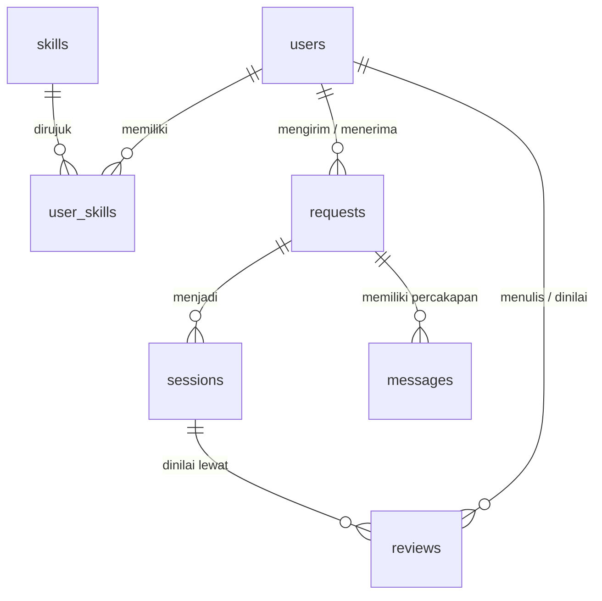
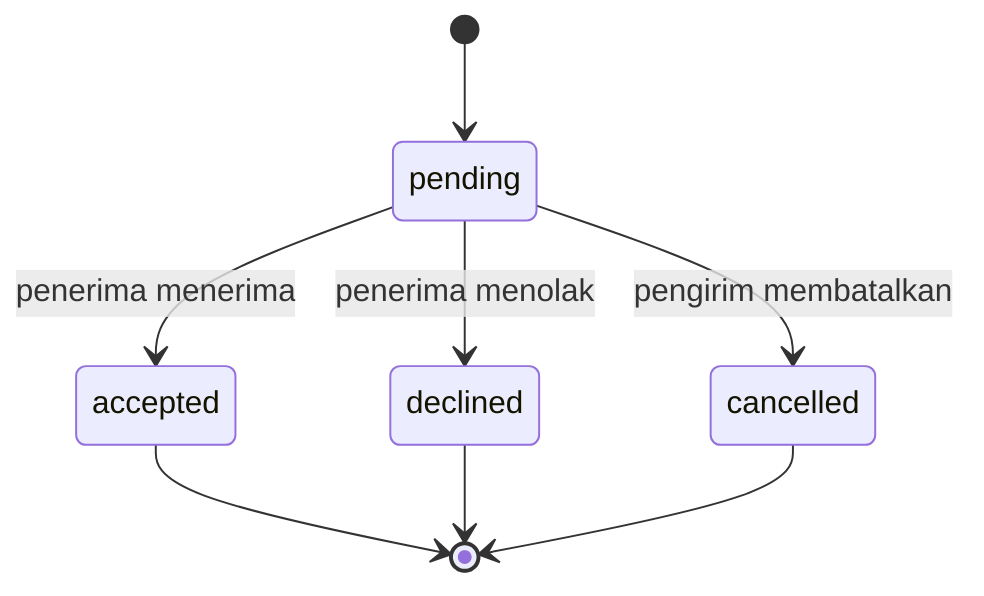
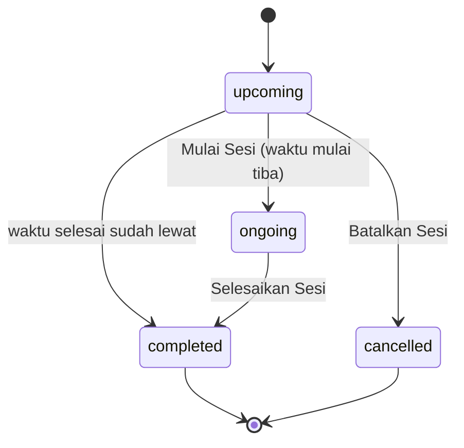

# SkillSwap 🎓

### Learn. Teach. Swap.

**SkillSwap** adalah aplikasi mobile berbasis **peer-to-peer skill exchange** yang dirancang untuk membantu mahasiswa menemukan teman belajar berdasarkan kemampuan yang mereka miliki dan skill yang ingin mereka pelajari.

Berbeda dari platform kursus pada umumnya, SkillSwap tidak berfokus pada transaksi jual beli kursus. Konsep utama aplikasi adalah **pertukaran pengetahuan antar mahasiswa**.

Pengguna dapat menjadi **learner** sekaligus **mentor** bagi pengguna lain.

> Dokumen ini adalah spesifikasi produk dan panduan penggunaan. Rancangan teknis lengkap (layer, skema Firestore, security rules, algoritma, kontrak service) ada di [`Architecture.md`](Architecture.md).

---

## Daftar Isi

1. [Deskripsi Masalah dan Solusi](#1-deskripsi-masalah-dan-solusi)
2. [Profil Target Pengguna](#2-profil-target-pengguna)
3. [Manfaat Aplikasi](#3-manfaat-aplikasi)
4. [Daftar Fitur Inti](#4-daftar-fitur-inti)
5. [User Flow](#5-user-flow)
6. [Fitur yang Tidak Dikerjakan](#6-fitur-yang-tidak-dikerjakan)
7. [Batasan Scope 12 Pertemuan](#7-batasan-scope-12-pertemuan)
8. [Kriteria Aplikasi Dinyatakan Berhasil](#8-kriteria-aplikasi-dinyatakan-berhasil)
9. [MVP Scope](#9-mvp-scope)
10. [Smart Matching Algorithm](#10-smart-matching-algorithm)
11. [Application Architecture (Ringkasan)](#11-application-architecture-ringkasan)
12. [Database Structure](#12-database-structure)
13. [Aturan Bisnis](#13-aturan-bisnis)
14. [Alur Status](#14-alur-status)
15. [Spesifikasi Halaman](#15-spesifikasi-halaman)
16. [Validasi Input](#16-validasi-input)
17. [Technology Stack](#17-technology-stack)
18. [UI/UX Guidelines](#18-uiux-guidelines)
19. [Aturan Penulisan Kode](#19-aturan-penulisan-kode)
20. [Privacy dan Safety](#20-privacy-dan-safety)
21. [Contoh Use Case](#21-contoh-use-case)
22. [Seed Data](#22-seed-data)
23. [Installation](#23-installation)
24. [Testing dan Checklist](#24-testing-dan-checklist)
25. [Project Structure](#25-project-structure)
26. [Future Development](#26-future-development)
27. [Unique Selling Point](#27-unique-selling-point)
28. [Project Goals](#28-project-goals)
29. [Development Status](#29-development-status)
30. [Academic Project](#30-academic-project)

---

# 📋 Project Scope

## 1. Deskripsi Masalah dan Solusi

Mahasiswa memiliki kemampuan dan kebutuhan belajar yang berbeda-beda. Ada mahasiswa yang menguasai programming, desain, editing, bahasa, public speaking, atau skill lainnya.

Di sisi lain, terdapat mahasiswa yang ingin mempelajari skill tersebut tetapi kesulitan menemukan teman belajar atau mentor yang sesuai.

Masalah yang ingin diselesaikan SkillSwap:

* Mahasiswa kesulitan menemukan teman belajar dengan skill yang sesuai.
* Mahasiswa yang memiliki kemampuan tertentu belum memiliki wadah untuk membagikan ilmunya.
* Proses mencari teman belajar masih dilakukan secara manual melalui lingkungan pertemanan atau komunitas.
* Platform pembelajaran pada umumnya lebih berfokus pada hubungan antara pengajar dan peserta, bukan pertukaran skill dua arah.
* Mahasiswa membutuhkan metode belajar yang lebih sosial dan interaktif.

### Solusi

SkillSwap mempertemukan mahasiswa berdasarkan dua jenis informasi:

**Skill yang dapat diajarkan** (*Can Teach*)
dan
**Skill yang ingin dipelajari** (*Want to Learn*)

Contohnya:

```text
Gabriel
Can Teach:
- UI/UX
- HTML/CSS

Want to Learn:
- Python
- Data Science
```

Kemudian sistem dapat menemukan mahasiswa lain:

```text
Andi
Can Teach:
- Python
- Data Science

Want to Learn:
- UI/UX
```

Keduanya dapat melakukan pertukaran skill:

```text
Gabriel → belajar Python dari Andi
Gabriel → mengajarkan UI/UX kepada Andi
```

Dengan demikian, proses belajar menjadi **dua arah dan saling menguntungkan**.

---

## 2. Profil Target Pengguna

Target utama SkillSwap adalah **mahasiswa perguruan tinggi**.

### Target pengguna utama

* Mahasiswa yang ingin mempelajari skill baru.
* Mahasiswa yang memiliki skill tertentu dan ingin mengajarkannya.
* Mahasiswa yang ingin mencari teman belajar.
* Mahasiswa yang ingin mengembangkan skill di luar perkuliahan.
* Mahasiswa yang ingin belajar melalui metode peer-to-peer.

### Target komunitas

SkillSwap dapat dikembangkan untuk:

* Mahasiswa dalam satu universitas.
* Organisasi mahasiswa.
* Komunitas kampus.
* Antaruniversitas.

Namun, untuk versi awal, aplikasi **difokuskan pada mahasiswa** agar ruang lingkup pengembangan tetap realistis untuk diselesaikan dalam **12 pertemuan**.

---

## 3. Manfaat Aplikasi

### 🎓 Bagi mahasiswa

* Mempermudah menemukan teman belajar.
* Membantu mendapatkan mentor sebaya.
* Mempermudah mencari skill yang ingin dipelajari.
* Memberikan kesempatan untuk mengajarkan skill yang dikuasai.
* Membantu mahasiswa mengembangkan kemampuan di luar perkuliahan.

### 🤝 Bagi komunitas kampus

* Membangun komunitas belajar berbasis peer-to-peer.
* Mendorong mahasiswa untuk saling berbagi pengetahuan.
* Meningkatkan interaksi antar mahasiswa.
* Membentuk lingkungan belajar yang lebih kolaboratif.

### 💡 Konsep utama

SkillSwap tidak hanya menanyakan:

> **"Apa yang ingin kamu pelajari?"**

Tetapi juga:

> **"Apa yang bisa kamu ajarkan?"**

---

## 4. Daftar Fitur Inti

Karena proyek harus diselesaikan dalam **12 pertemuan**, fitur inti dibatasi pada fungsi yang mendukung alur utama pertukaran skill.

### 1. Authentication 🔐

Pengguna dapat:

* Register (email dan kata sandi).
* Login.
* Logout.
* Mengelola akun: mengubah data profil dan mengirim email reset kata sandi.

---

### 2. User Profile 👤

Profile pengguna berisi:

* Nama.
* Foto profil (opsional saat pendaftaran).
* Universitas.
* Program studi.
* Tahun angkatan.
* Rating.
* Skill yang dapat diajarkan.
* Skill yang ingin dipelajari.
* Availability.
* Mode pembelajaran (online, offline, atau fleksibel).

Contoh:

```text
Gabriel
Informatics Student

⭐ 4.8 Rating

CAN TEACH
🎨 UI/UX
💻 HTML/CSS

WANT TO LEARN
🐍 Python
📊 Data Science
```

---

### 3. Skill Management 🧠

Pengguna dapat menentukan:

#### I Can Teach

Skill yang dikuasai dan dapat diajarkan.

Contoh: Python, UI/UX, Figma, Photoshop, Video Editing, Public Speaking.

#### I Want to Learn

Skill yang ingin dipelajari.

Contoh: Data Science, Java, Photography, English, Marketing.

Setiap skill memiliki level (`beginner`, `intermediate`, `advanced`). Satu skill tidak boleh berada di kedua daftar sekaligus, dan maksimal 10 skill per daftar.

---

### 4. Skill Discovery 🔎

Pengguna dapat mencari pengguna berdasarkan skill, melalui kotak pencarian nama skill dan filter kategori.

Kategori:

* Programming
* Design
* Business
* Academic
* Language
* Creative
* Marketing
* Productivity

Hasil pencarian adalah daftar pengguna yang **dapat mengajarkan** skill yang dipilih.

---

### 5. Skill Matching 🎯

Sistem memberikan rekomendasi pengguna berdasarkan kecocokan skill.

Parameter utama:

* Skill yang ingin dipelajari.
* Skill yang dapat diajarkan.
* Skill yang ingin dipelajari pengguna lain.
* Skill yang dapat diajarkan pengguna lain.
* Availability.
* Mode pembelajaran.

Contoh:

```text
🎯 95% MATCH

Andi Pratama

Can Teach:
🐍 Python
📊 Data Science

Wants to Learn:
🎨 UI/UX
```

Untuk versi awal, sistem matching menggunakan **scoring sederhana**, bukan Artificial Intelligence (lihat [bagian 10](#10-smart-matching-algorithm)).

---

### 6. SkillSwap Request 🤝

Pengguna dapat mengirim permintaan pertukaran skill.

Contoh:

```text
SkillSwap Request

I want to learn:
🐍 Python

I can teach:
🎨 UI/UX

Message:

"Hi! I would like to learn Python from you.
In exchange, I can help you learn UI/UX."
```

Penerima dapat:

* Accept.
* Decline.

Pengirim dapat **membatalkan** (cancel) request selama statusnya masih `pending`.

---

### 7. Chat 💬

Setelah request diterima, pengguna dapat berkomunikasi.

Fitur:

* Text message.
* Timestamp.
* Read status.

Chat digunakan untuk membahas proses dan jadwal belajar. Chat bersifat real-time.

---

### 8. Session Scheduling 📅

Pengguna dapat membuat sesi belajar dari request yang sudah diterima.

Informasi session:

* Skill.
* Teacher.
* Learner.
* Date.
* Start time.
* End time.
* Mode.
* Meeting link.
* Status.

Contoh:

```text
Python Basic

Teacher:
Andi Pratama

Learner:
Gabriel

Date:
19 September 2026

Time:
14:00 - 15:30

Mode:
Online

Status:
Upcoming
```

---

### 9. Rating & Review ⭐

Setelah session selesai, pengguna dapat memberikan rating kepada lawan sesinya.

```text
⭐ ⭐ ⭐ ⭐ ⭐
```

Pengguna juga dapat memberikan komentar mengenai pengalaman belajar.

Rating dapat digunakan sebagai salah satu informasi pendukung dalam sistem matching.

---

## 5. User Flow

Alur utama aplikasi:

```text
Splash Screen
      ↓
Login / Register
      ↓
Complete Profile
      ↓
Select Skills
      ↓
Set Availability
      ↓
Home
      ↓
Discover
      ↓
Find Match
      ↓
View Profile
      ↓
SkillSwap Request
      ↓
Accept Request
      ↓
Chat
      ↓
Schedule Session
      ↓
Learning Session
      ↓
Complete Session
      ↓
Rating & Review
```

Alur tersebut merupakan **core workflow** yang menjadi fokus utama pengembangan dalam 12 pertemuan.

---

## 6. Fitur yang Tidak Dikerjakan

Untuk menjaga agar proyek realistis dan dapat diselesaikan dalam **12 pertemuan**, fitur berikut **tidak menjadi bagian dari implementasi utama**.

### ❌ Tidak termasuk dalam MVP

* AI Skill Recommendation.
* Skill Assessment.
* Personalized Learning Roadmap.
* Leaderboard.
* Calendar Integration.
* Sistem pembayaran.
* Marketplace atau jual beli kursus.
* Integrasi video conference langsung.
* Advanced Learning Progress.
* Gamification kompleks.
* Achievement system.
* Sistem subscription.
* Verifikasi sertifikat skill.
* Push notification (Firebase Cloud Messaging hanya dicantumkan sebagai rencana, tidak diimplementasikan di MVP).
* Penghapusan akun.

Fitur-fitur tersebut dapat menjadi bagian dari **future development** apabila aplikasi dikembangkan lebih lanjut.

---

## 7. Batasan Scope 12 Pertemuan

Agar pengembangan tetap realistis, project dibatasi pada:

```text
Authentication
      ↓
User Profile
      ↓
Skill Management
      ↓
Skill Discovery
      ↓
Skill Matching
      ↓
SkillSwap Request
      ↓
Chat
      ↓
Session Scheduling
      ↓
Rating & Review
```

Fokus utama bukan pada jumlah fitur sebanyak mungkin, tetapi memastikan **core workflow dapat berjalan dari awal hingga akhir**.

Usulan pembagian pertemuan (dapat disesuaikan):

| Pertemuan | Fokus |
|---|---|
| 1 | Spesifikasi, setup Flutter dan Firebase, struktur folder |
| 2 | Authentication |
| 3 | User Profile dan onboarding |
| 4 | Skill Management dan seed data skill |
| 5 | Skill Discovery |
| 6 | Skill Matching (service dan UI) |
| 7 | SkillSwap Request |
| 8 | Chat real-time |
| 9 | Session Scheduling |
| 10 | Rating dan Review |
| 11 | Security rules, error handling, testing |
| 12 | Perbaikan bug, build APK, presentasi |

---

## 8. Kriteria Aplikasi Dinyatakan Berhasil

Aplikasi dinyatakan berhasil apabila pengguna dapat menyelesaikan proses utama SkillSwap tanpa mengalami kegagalan fungsi.

### Functional Criteria

Pengguna harus dapat:

* Membuat akun.
* Login ke aplikasi.
* Melengkapi profile.
* Menentukan skill yang dapat diajarkan.
* Menentukan skill yang ingin dipelajari.
* Menemukan pengguna lain.
* Mendapatkan hasil matching.
* Mengirim SkillSwap Request.
* Menerima atau menolak request.
* Melakukan chat setelah request diterima.
* Membuat jadwal session.
* Menyelesaikan session.
* Memberikan rating dan review.

### Technical Criteria

Aplikasi harus:

* Dapat dijalankan pada perangkat Android.
* Memiliki interface yang dapat digunakan dengan baik.
* Dapat menyimpan data pengguna.
* Dapat menyimpan data skill.
* Dapat menyimpan request.
* Dapat menyimpan data session.
* Dapat menyimpan chat.
* Dapat menyimpan rating dan review.
* Memiliki alur navigasi yang jelas.
* Tidak mengalami error pada core workflow.
* Lolos `flutter analyze` tanpa error dan seluruh unit test lulus.
* Dapat di-build menjadi APK (`flutter build apk`).

### Project Success Criteria

Secara keseluruhan, MVP dianggap berhasil apabila:

> **Seorang mahasiswa dapat mendaftar, menentukan skill yang ingin dipelajari dan diajarkan, menemukan mahasiswa yang sesuai, melakukan SkillSwap, berkomunikasi, menjadwalkan sesi belajar, menyelesaikan sesi, dan memberikan rating.**

Checklist pengujian untuk membuktikan seluruh kriteria di atas ada di [bagian 24](#24-testing-dan-checklist).

---

## 9. MVP Scope

### Core Features

| Feature             | Status | Prioritas |
| ------------------- | ------ | --------- |
| Authentication      | ✅      | High      |
| User Profile        | ✅      | High      |
| Skill Selection     | ✅      | High      |
| Teach / Learn Skill | ✅      | High      |
| Skill Discovery     | ✅      | High      |
| Skill Matching      | ✅      | High      |
| SkillSwap Request   | ✅      | High      |
| Chat                | ✅      | High      |
| Session Scheduling  | ✅      | High      |
| Rating & Review     | ✅      | High      |

### Future Features

| Feature              | Status |
| -------------------- | ------ |
| XP                   | Future |
| Achievement          | Future |
| Learning Progress    | Future |
| Notification         | Future |
| Leaderboard          | Future |
| AI Recommendation    | Future |
| Calendar Integration | Future |
| Skill Assessment     | Future |
| Learning Roadmap     | Future |
| Block / Report User  | Opsional (dikerjakan jika waktu tersisa, tidak termasuk kriteria berhasil) |

---

## 10. Smart Matching Algorithm

Versi awal SkillSwap menggunakan sistem **scoring sederhana (rule-based)**.

Parameter:

```text
Skill Match          50%
Reverse Skill Match  20%
Schedule Match       15%
Learning Mode        10%
Rating                5%
```

Formula:

```text
Match Score =
(Skill Match × 0.50)
+
(Reverse Match × 0.20)
+
(Schedule Match × 0.15)
+
(Mode Match × 0.10)
+
(Rating × 0.05)
```

Definisi tiap komponen (nilai 0–100). A adalah pengguna yang sedang login, B adalah kandidat:

| Komponen | Aturan |
|---|---|
| Skill Match | 100 jika ada minimal satu skill *Want to Learn* A yang ada di *Can Teach* B, selain itu 0 |
| Reverse Match | 100 jika ada minimal satu skill *Want to Learn* B yang ada di *Can Teach* A, selain itu 0 |
| Schedule Match | `slot sama / jumlah slot terkecil (A atau B) × 100`; 0 jika salah satu belum mengisi availability |
| Mode Match | Mode sama = 100; salah satunya fleksibel = 50; online vs offline = 0 |
| Rating | `rating B / 5 × 100`; 0 jika B belum punya rating |

Kandidat yang ditampilkan di rekomendasi adalah pengguna dengan Skill Match = 100. Kandidat dengan Reverse Match = 100 diberi label **"Pertukaran dua arah"**.

Contoh perhitungan:

```text
Skill Match:       100
Reverse Match:     100
Schedule Match:     80
Mode Match:        100
Rating:             70   (rating 3,5 dari 5)
```

Hasil:

```text
Final Score = 50 + 20 + 12 + 10 + 3,5 = 95,5
```

Skor dibulatkan ke bilangan bulat terdekat (0,5 dibulatkan ke atas), lalu ditampilkan kepada pengguna:

```text
🎯 96% Match
```

> **Catatan:** Matching pada MVP tidak menggunakan AI. Sistem menggunakan rule-based scoring agar realistis untuk pengembangan dalam 12 pertemuan.

---

## 11. Application Architecture (Ringkasan)

SkillSwap dirancang menggunakan arsitektur sederhana tanpa server backend custom:

```text
┌─────────────────────┐
│      Mobile App     │
│       Flutter       │
└──────────┬──────────┘
           │
           ↓
┌─────────────────────┐
│   Firebase Auth     │
│   Authentication    │
└──────────┬──────────┘
           │
           ↓
┌─────────────────────┐
│   Cloud Firestore   │
│      Database       │
└──────────┬──────────┘
           │
      ┌────┴─────┐
      ↓          ↓
┌───────────┐ ┌────────────────┐
│ Firebase  │ │ Firebase Cloud │
│ Storage   │ │ Messaging      │
│           │ │ (rencana,      │
│ Profile   │ │ tidak aktif    │
│ Image     │ │ di MVP)        │
└───────────┘ └────────────────┘
```

Di dalam aplikasi, kode disusun berlapis: **Screens/Widgets → Providers → Services → Firebase**. Detail ada di [`Architecture.md`](Architecture.md).

---

## 12. Database Structure

Database menggunakan Cloud Firestore dengan koleksi di root level. Nama field memakai `snake_case`.

Relasi antar koleksi:



## Users

```text
users
├── id                  (sama dengan UID Firebase Auth)
├── name
├── email
├── university
├── major
├── year                (tahun angkatan)
├── profile_picture     (URL foto, boleh kosong)
├── availability        (array slot, contoh: "sat_morning")
├── learning_mode       (online | offline | flexible)
├── rating              (rata-rata, 0–5, 1 desimal)
├── rating_sum
├── rating_count
├── total_sessions
├── profile_completed   (true setelah onboarding selesai)
└── created_at
```

> `availability`, `learning_mode`, `rating_sum`, `rating_count`, dan `profile_completed` ditambahkan karena dibutuhkan oleh fitur yang sudah ada (Schedule Match, Mode Match, perhitungan rata-rata rating, dan routing onboarding).

Slot availability: kombinasi hari `mon, tue, wed, thu, fri, sat, sun` dan waktu `morning` (08:00–12:00), `afternoon` (12:00–17:00), `evening` (17:00–21:00). Total 21 slot.

---

## Skills

```text
skills
├── id                  (slug, contoh: "python")
├── name
├── category
└── description
```

Data skill diisi lewat seed (lihat [bagian 22](#22-seed-data)), pengguna tidak dapat membuat skill baru.

---

## User Skills

```text
user_skills
├── id                  ({user_id}_{skill_id}_{type})
├── user_id
├── skill_id
├── type
└── level
```

Type:

```text
teach
learn
```

Level:

```text
beginner
intermediate
advanced
```

---

## SkillSwap Requests

```text
requests
├── id
├── sender_id
├── receiver_id
├── teach_skill         (skill_id yang diajarkan pengirim)
├── learn_skill         (skill_id yang ingin dipelajari pengirim)
├── message
├── status
└── created_at
```

Status:

```text
pending
accepted
declined
cancelled
```

---

## Sessions

```text
sessions
├── id
├── request_id
├── teacher_id
├── learner_id
├── skill_id
├── date                (Timestamp, tanggal sesi)
├── start_time          (Timestamp, tanggal + jam mulai)
├── end_time            (Timestamp, tanggal + jam selesai)
├── mode                (online | offline)
├── meeting_link        (wajib untuk online, kosong untuk offline)
├── status
└── created_at
```

Status:

```text
upcoming
ongoing
completed
cancelled
```

---

## Messages

```text
messages
├── id
├── conversation_id     (sama dengan id request yang berstatus accepted)
├── sender_id
├── receiver_id
├── message
├── timestamp
└── read_status
```

---

## Reviews

```text
reviews
├── id                  ({session_id}_{reviewer_id})
├── reviewer_id
├── reviewed_user_id
├── session_id
├── rating              (1–5)
├── comment
└── created_at
```

> Skema lengkap beserta tipe data, index, dan security rules ada di [`Architecture.md`](Architecture.md) bagian 6.

---

## 13. Aturan Bisnis

| Kode | Aturan |
|---|---|
| BR-01 | Satu email hanya dapat dipakai untuk satu akun. |
| BR-02 | Pengguna belum dapat masuk ke Home sebelum profil lengkap: nama, universitas, program studi, tahun angkatan, minimal 1 skill *Can Teach*, minimal 1 skill *Want to Learn*, minimal 1 slot availability, dan mode pembelajaran. Foto profil opsional. |
| BR-03 | Satu skill tidak boleh berada di daftar *Can Teach* dan *Want to Learn* sekaligus. Maksimal 10 skill per daftar. |
| BR-04 | Pengguna tidak dapat mengirim request ke dirinya sendiri. |
| BR-05 | Tidak boleh ada dua request aktif (`pending` atau `accepted`) dengan kombinasi pengirim, penerima, `teach_skill`, dan `learn_skill` yang sama. |
| BR-06 | `teach_skill` harus ada di daftar *Can Teach* pengirim, dan `learn_skill` harus ada di daftar *Can Teach* penerima. |
| BR-07 | Hanya penerima yang dapat menerima atau menolak request, dan hanya pengirim yang dapat membatalkannya. Semua perubahan status hanya dapat dilakukan saat status `pending`. |
| BR-08 | Chat hanya tersedia untuk request berstatus `accepted`, dan hanya antara pengirim dan penerima request tersebut. |
| BR-09 | Session hanya dapat dibuat dari request `accepted`. Teacher adalah pengguna yang mengajarkan skill sesi: pengirim jika skill = `teach_skill`, penerima jika skill = `learn_skill`. Satu request dapat memiliki dua session (satu per arah pertukaran). |
| BR-10 | Tanggal dan jam mulai session tidak boleh di masa lalu, jam selesai harus setelah jam mulai. Mode online wajib berisi meeting link berformat URL `http`/`https`. |
| BR-11 | Perubahan status session mengikuti [diagram status](#14-alur-status). |
| BR-12 | Review hanya dapat dibuat oleh peserta session berstatus `completed`, ditujukan ke peserta lainnya, dan hanya satu kali per session per reviewer. |
| BR-13 | Rating pengguna adalah rata-rata seluruh review yang diterima (`rating_sum / rating_count`, satu desimal). Saat session selesai, `total_sessions` kedua peserta bertambah 1. |
| BR-14 | Request, session, pesan, dan review tidak dihapus dari aplikasi. Pembatalan dicatat lewat status. |
| BR-15 | Aplikasi tidak menyimpan atau menampilkan alamat pribadi pengguna. |

---

## 14. Alur Status

### Request



### Session



Setiap peserta session (teacher maupun learner) dapat menjalankan transisi di atas.

---

## 15. Spesifikasi Halaman

Navigasi utama menggunakan **bottom navigation** dengan lima tab: **Beranda**, **Temukan**, **Chat**, **Sesi**, **Profil**.

| Halaman | Isi dan fungsi |
|---|---|
| Splash | Logo, mengecek status login dan kelengkapan profil, lalu mengarahkan ke Login, Onboarding, atau Home. |
| Login | Email, kata sandi, tombol Masuk, tautan Daftar dan Lupa Kata Sandi. |
| Register | Nama, email, kata sandi, konfirmasi kata sandi. |
| Complete Profile | Foto (opsional), universitas, program studi, tahun angkatan. |
| Select Skills | Memilih skill *Bisa Mengajar* dan *Ingin Belajar* (dengan level), difilter per kategori. |
| Availability | Memilih slot hari dan waktu, serta mode pembelajaran. |
| Beranda | Ringkasan: request masuk yang menunggu, sesi mendatang, sesi selesai, rating; 3 rekomendasi teratas; sesi terdekat; pintasan ke kotak request. |
| Temukan | Dua tab: **Rekomendasi** (hasil matching terurut skor) dan **Cari Skill** (pencarian dan filter kategori). |
| Profil Pengguna Lain | Info profil, skill, availability, rating, ulasan, rincian skor match, tombol *Kirim SkillSwap Request*. |
| Kirim Request | Pilih skill yang diajarkan, pilih skill yang ingin dipelajari, pesan (terisi template). |
| Kotak Request | Tab **Masuk** (tombol Terima/Tolak) dan **Terkirim** (tombol Batalkan jika masih menunggu); request diterima menampilkan tombol *Buka Chat*. |
| Daftar Chat | Percakapan dari request yang diterima, urut pesan terbaru, penanda belum dibaca. |
| Ruang Chat | Gelembung pesan real-time, timestamp, status dibaca, tombol *Jadwalkan Sesi*. |
| Jadwalkan Sesi | Pilih skill, tanggal, jam mulai, jam selesai, mode, tautan meeting. |
| Daftar Sesi | Tab Mendatang, Selesai, Dibatalkan. |
| Detail Sesi | Info sesi, tombol *Mulai Sesi*, *Selesaikan Sesi*, *Batalkan Sesi*, *Beri Rating* sesuai status. |
| Rating dan Review | Bintang 1–5 dan komentar. |
| Profil Saya | Data diri, rating, skill, availability, ulasan yang diterima, tombol Edit, Reset Kata Sandi, Keluar. |

Setiap halaman yang memuat data memiliki tiga state: **loading**, **kosong**, dan **error dengan tombol Coba Lagi**.

---

## 16. Validasi Input

| Input | Aturan | Pesan |
|---|---|---|
| Email | Format email valid | "Format email tidak valid." |
| Kata sandi | Minimal 8 karakter | "Kata sandi minimal 8 karakter." |
| Konfirmasi kata sandi | Sama dengan kata sandi | "Konfirmasi kata sandi tidak sama." |
| Nama | 2–50 karakter | "Nama harus 2 sampai 50 karakter." |
| Universitas, program studi | Wajib, 2–80 karakter | "Kolom ini wajib diisi." |
| Tahun angkatan | Angka antara 2000 dan tahun berjalan | "Tahun angkatan tidak valid." |
| Skill | Minimal 1 *Bisa Mengajar* dan 1 *Ingin Belajar*, maksimal 10 per daftar | "Pilih minimal satu skill di setiap daftar." |
| Availability | Minimal 1 slot | "Pilih minimal satu waktu tersedia." |
| Pesan request | 1–300 karakter | "Pesan harus 1 sampai 300 karakter." |
| Pesan chat | 1–1000 karakter | "Pesan tidak boleh kosong." |
| Tanggal dan jam sesi | Tidak di masa lalu, selesai setelah mulai | "Waktu sesi tidak valid." |
| Meeting link | URL `http`/`https` (mode online) | "Tautan meeting tidak valid." |
| Rating | Wajib, 1–5 | "Pilih rating terlebih dahulu." |
| Komentar review | Opsional, maksimal 300 karakter | "Komentar maksimal 300 karakter." |

---

## 17. Technology Stack

### Frontend

**Flutter**

* Dart 3
* Material Design 3
* Responsive UI
* Provider (state management)

### Backend

**Firebase**

* Firebase Authentication (email dan kata sandi)
* Cloud Firestore
* Firebase Storage (foto profil)

> ⚠️ **Catatan paket Firebase:** sejak 3 Februari 2026, Cloud Storage for Firebase memerlukan paket **Blaze** (pay-as-you-go, ada kuota gratis) dan tidak lagi tersedia di paket Spark. Authentication dan Firestore tetap dapat dipakai di Spark. Jika ingin tetap di Spark, lihat opsi foto profil di bagian [Installation](#23-installation) dan `Architecture.md` bagian 6.5.

### Development Tools

* Android Studio
* Visual Studio Code
* Git
* GitHub
* Firebase CLI dan FlutterFire CLI
* Node.js (hanya untuk skrip seed)

---

## 18. UI/UX Guidelines

SkillSwap menggunakan konsep desain:

* Modern.
* Clean.
* Minimal.
* Friendly.
* Student-oriented.
* Easy to navigate.

Komponen UI:

* Rounded cards.
* Skill chips.
* Progress indicators jika diperlukan.
* Rating stars.
* Bottom navigation.
* Clear typography.
* Empty states.
* Loading states.
* Error states.
* Dialog konfirmasi.

Aturan UI:

* **Bahasa antarmuka adalah Bahasa Indonesia** untuk seluruh label, tombol, pesan, dan validasi. Nama skill dan nama pengguna tetap apa adanya. Format tanggal memakai locale `id_ID`.
* Istilah konsep pada dokumen ini diterjemahkan di UI:

| Istilah di dokumen | Label di aplikasi |
|---|---|
| Can Teach | Bisa Mengajar |
| Want to Learn | Ingin Belajar |
| Match | Kecocokan |
| SkillSwap Request | Permintaan SkillSwap |
| Accept / Decline | Terima / Tolak |
| Session | Sesi |

* **Dialog konfirmasi** wajib muncul sebelum: keluar akun, menolak request, membatalkan request, membatalkan sesi, menyelesaikan sesi, dan menghapus skill dari profil.
* **Warna badge status:**

| Status | Warna |
|---|---|
| `pending` | Oranye |
| `accepted`, `completed` | Hijau |
| `declined` | Merah |
| `cancelled` | Abu-abu |
| `upcoming` | Biru |
| `ongoing` | Kuning |

Desain dibuat sederhana agar pengguna dapat memahami fungsi aplikasi tanpa membutuhkan banyak langkah.

---

## 19. Aturan Penulisan Kode

* Mengikuti gaya resmi Dart dan lint `flutter_lints`.
* File memakai `snake_case`; class, enum, dan widget memakai `UpperCamelCase`; variabel, parameter, dan method memakai `lowerCamelCase`.
* Nama field Firestore memakai `snake_case` (sesuai [bagian 12](#12-database-structure)). Konversi ke properti `lowerCamelCase` di model dilakukan lewat `fromMap` dan `toMap`.
* Panjang baris maksimal 100 karakter. Jalankan `dart format -l 100 .`.
* Tidak menambahkan komentar kecuali benar-benar diperlukan.
* Screen dan widget **dilarang** mengimpor paket `firebase_*` secara langsung. Semua akses Firebase lewat `services/`.
* Tidak ada string UI yang di-hardcode di dalam logic. Teks UI dikumpulkan di `core/constants/app_strings.dart`.
* Tidak ada rahasia (kunci service account) di repository.

---

## 20. Privacy dan Safety

Karena SkillSwap mempertemukan pengguna secara langsung, aspek keamanan menjadi perhatian.

Fitur yang tersedia di MVP:

* Cancel session.
* Rating system.
* Community guidelines (ditampilkan saat pendaftaran dan di halaman profil).
* Firestore Security Rules sehingga pengguna hanya dapat mengakses data miliknya.

Fitur opsional (dikerjakan jika waktu tersisa, tidak termasuk kriteria berhasil):

* Block user.
* Report user.

Untuk pertemuan offline:

> Pengguna disarankan melakukan pertemuan di tempat umum seperti kampus, perpustakaan, cafe, atau study space.

Pengingat ini ditampilkan pada form *Jadwalkan Sesi* saat mode offline dipilih. Aplikasi tidak menampilkan alamat pribadi pengguna.

---

## 21. Contoh Use Case

### Case 1 — Programming

Gabriel ingin belajar Python.

Gabriel dapat mengajarkan UI/UX.

Sistem menemukan Andi:

```text
Gabriel
Want to Learn:
Python

Can Teach:
UI/UX
```

```text
Andi
Can Teach:
Python

Want to Learn:
UI/UX
```

Mereka memiliki kecocokan dua arah.

```text
Gabriel ←──── Python ──── Andi
Gabriel ───── UI/UX ────→ Andi
```

Kemudian mereka dapat:

```text
Match
 ↓
Request
 ↓
Accept
 ↓
Chat
 ↓
Schedule
 ↓
Learning Session
 ↓
Rating
```

### Case 2 — Design

Sarah ingin belajar Photoshop.

Kevin dapat mengajarkan Photoshop tetapi ingin belajar Public Speaking.

Sarah dapat mengajarkan Public Speaking.

Sistem dapat mempertemukan Sarah dan Kevin berdasarkan kecocokan tersebut.

---

## 22. Seed Data

Data awal disediakan agar aplikasi dapat langsung didemokan dan diuji. Seed dijalankan sekali lewat skrip di `tools/seed/` (lihat [Installation](#23-installation)).

### Skill (koleksi `skills`)

| Kategori | Skill |
|---|---|
| Programming | Python, JavaScript, Java, Flutter, HTML/CSS, SQL, Git dan GitHub, Data Science |
| Design | UI/UX, Figma, Photoshop, Illustrator, Canva |
| Business | Entrepreneurship, Business Plan, Financial Literacy |
| Academic | Calculus, Statistics, Academic Writing, Research Methodology |
| Language | English, Japanese, Mandarin, Korean |
| Creative | Photography, Video Editing, Music Production, Content Writing |
| Marketing | Digital Marketing, Social Media Marketing, SEO, Copywriting |
| Productivity | Public Speaking, Time Management, Note Taking, Microsoft Excel |

### Pengguna demo

Semua akun demo memakai kata sandi `Password123` (hanya untuk development).

| Nama | Email | Bisa Mengajar | Ingin Belajar | Mode |
|---|---|---|---|---|
| Gabriel | gabriel@skillswap.test | UI/UX, HTML/CSS | Python, Data Science | Online |
| Andi Pratama | andi@skillswap.test | Python, Data Science | UI/UX | Online |
| Sarah | sarah@skillswap.test | Public Speaking | Photoshop | Fleksibel |
| Kevin | kevin@skillswap.test | Photoshop | Public Speaking | Offline |
| Dina | dina@skillswap.test | English | Music Production | Online |

Dengan data ini, hasil yang diharapkan:

* Gabriel melihat Andi di rekomendasi dengan label *Pertukaran dua arah* dan skor sekitar **96%**.
* Sarah dan Kevin saling merekomendasikan (dua arah).
* Dina tidak muncul di rekomendasi Gabriel (tidak ada skill yang cocok).

Request, session, chat, dan review sengaja tidak di-seed. Data tersebut dibuat melalui aplikasi saat pengujian alur utama.

---

## 23. Installation

### Prasyarat

* Flutter SDK (channel stable) dengan Dart 3
* Android Studio (SDK Android dan emulator) atau perangkat Android fisik
* Node.js 18 atau lebih baru (untuk Firebase CLI dan skrip seed)
* Akun Google untuk Firebase
* Android `minSdkVersion` minimal 23 (persyaratan FlutterFire)

### 1. Clone Repository

```bash
git clone https://github.com/username/skillswap.git
```

Masuk ke folder project:

```bash
cd skillswap
```

---

### 2. Install Dependencies

```bash
flutter pub get
```

Dependency utama: `firebase_core`, `firebase_auth`, `cloud_firestore`, `firebase_storage`, `provider`, `image_picker`, `intl`, `url_launcher`. Dev dependency: `flutter_test`, `flutter_lints`.

---

### 3. Firebase Configuration

Buat project baru pada [Firebase Console](https://console.firebase.google.com) kemudian aktifkan:

* **Authentication** → metode *Email/Password*.
* **Cloud Firestore** → mulai dalam mode *production* (bukan test mode), pilih lokasi terdekat (misalnya `asia-southeast2` Jakarta).
* **Firebase Storage** → memerlukan paket **Blaze** (lihat catatan di [bagian 17](#17-technology-stack)). Pasang *budget alert* di Google Cloud Billing agar biaya terpantau.

> **Opsi tanpa Blaze:** jika tidak ingin memakai Blaze, foto profil disimpan sebagai gambar terkompresi (maksimal 100 KB) pada field `profile_picture` di dokumen user. Hanya implementasi `storage_service.dart` yang berbeda, fungsi aplikasi tidak berubah. Detail di `Architecture.md` bagian 6.5.

Instal tools lalu hubungkan aplikasi ke project Firebase:

```bash
npm install -g firebase-tools
firebase login
dart pub global activate flutterfire_cli
flutterfire configure
```

Perintah `flutterfire configure` menghasilkan `lib/firebase_options.dart` dan `android/app/google-services.json`.

---

### 4. Deploy Security Rules dan Index

Repository sudah menyertakan `firestore.rules`, `firestore.indexes.json`, dan `storage.rules`. Deploy dengan:

```bash
firebase deploy --only firestore:rules,firestore:indexes
firebase deploy --only storage
```

Perintah kedua hanya diperlukan jika memakai Firebase Storage. Index butuh beberapa menit sampai berstatus *Enabled* di Firebase Console.

---

### 5. Seed Data

1. Di Firebase Console buka *Project settings → Service accounts → Generate new private key*.
2. Simpan file sebagai `tools/seed/serviceAccountKey.json`. File ini sudah masuk `.gitignore`, **jangan pernah di-commit**.
3. Jalankan:

```bash
cd tools/seed
npm install
npm run seed
cd ../..
```

Skrip mengisi koleksi `skills`, membuat akun demo di Firebase Auth, serta dokumen `users` dan `user_skills` (lihat [bagian 22](#22-seed-data)). Skrip aman dijalankan ulang karena memakai ID dokumen yang tetap.

---

### 6. Run Application

Jalankan emulator atau sambungkan perangkat Android.

Kemudian:

```bash
flutter run
```

Login dengan salah satu akun demo, misalnya `gabriel@skillswap.test` dengan kata sandi `Password123`.

---

### 7. Build APK

```bash
flutter build apk --release
```

Hasil: `build/app/outputs/flutter-apk/app-release.apk`.

---

### Troubleshooting

| Masalah | Penyebab dan solusi |
|---|---|
| `permission-denied` saat membaca data | Rules belum di-deploy, atau pengguna belum login. Jalankan ulang langkah 4. |
| Error "query requires an index" | Index belum selesai dibuat. Klik tautan pada pesan error atau tunggu hingga *Enabled*. |
| Upload foto gagal (402/403) | Firebase Storage memerlukan paket Blaze. Upgrade atau pakai opsi tanpa Blaze. |
| `flutterfire configure` gagal | Pastikan sudah `firebase login` dan `dart pub global` ada di `PATH`. |
| Build gagal karena `minSdkVersion` | Ubah `minSdkVersion` menjadi 23 di `android/app/build.gradle`. |

---

## 24. Testing dan Checklist

### Automated

```bash
flutter analyze
flutter test
```

Unit test minimal:

* `matching_service`: contoh pada [bagian 10](#10-smart-matching-algorithm) menghasilkan 95,5 dan ditampilkan 96%; kasus availability kosong; kasus mode fleksibel; kasus pengguna tanpa rating.
* `validators`: seluruh aturan pada [bagian 16](#16-validasi-input).
* Transisi status request dan session sesuai [bagian 14](#14-alur-status).

### Manual (end-to-end)

Gunakan dua perangkat atau dua emulator (login sebagai Gabriel dan Andi). Seluruh langkah harus berhasil tanpa error.

- [ ] Register akun baru dan login.
- [ ] Melengkapi profil, memilih skill *Bisa Mengajar* dan *Ingin Belajar*, mengisi availability dan mode.
- [ ] Logout lalu login kembali; data profil tetap tersimpan.
- [ ] Tab Temukan menampilkan rekomendasi terurut skor, dan pencarian skill/kategori berfungsi.
- [ ] Membuka profil pengguna lain dan mengirim Permintaan SkillSwap.
- [ ] Mengirim request duplikat ditolak (BR-05) dan request ke diri sendiri tidak dimungkinkan (BR-04).
- [ ] Penerima menerima request; chat terbuka dan pesan muncul real-time di kedua perangkat dengan status dibaca.
- [ ] Penerima lain menolak request; chat tidak tersedia (BR-08).
- [ ] Membuat jadwal sesi online dengan meeting link; validasi waktu dan link berfungsi (BR-10).
- [ ] Membatalkan sesi menampilkan dialog konfirmasi dan status menjadi `cancelled`.
- [ ] Menjalankan alur Mulai Sesi lalu Selesaikan Sesi; `total_sessions` kedua pengguna bertambah.
- [ ] Memberi rating dan review; rating pengguna tujuan terhitung ulang, review kedua kali untuk sesi yang sama ditolak (BR-12).
- [ ] Mematikan koneksi internet: pesan error yang ramah dan tombol *Coba Lagi* muncul.
- [ ] Semua teks antarmuka berbahasa Indonesia.

---

## 25. Project Structure

Struktur project:

```text
skillswap/
├── lib/
│   ├── main.dart
│   ├── firebase_options.dart
│   ├── core/
│   │   ├── constants/      # warna, string, ukuran, slot availability
│   │   ├── errors/         # app_exception.dart
│   │   ├── theme/
│   │   └── utils/          # validators, format tanggal
│   ├── models/
│   │   ├── user_model.dart
│   │   ├── skill_model.dart
│   │   ├── user_skill_model.dart
│   │   ├── request_model.dart
│   │   ├── session_model.dart
│   │   ├── message_model.dart
│   │   ├── review_model.dart
│   │   └── match_result.dart
│   ├── services/
│   │   ├── auth_service.dart
│   │   ├── firestore_service.dart
│   │   ├── matching_service.dart
│   │   ├── storage_service.dart
│   │   └── chat_service.dart
│   ├── providers/
│   ├── screens/
│   │   ├── auth/
│   │   ├── onboarding/
│   │   ├── home/
│   │   ├── discover/
│   │   ├── request/
│   │   ├── chat/
│   │   ├── session/
│   │   └── profile/
│   ├── widgets/
│   └── routes/
│       └── app_routes.dart
├── test/
├── tools/
│   └── seed/               # skrip seed (Node.js + firebase-admin)
├── firestore.rules
├── firestore.indexes.json
├── storage.rules
├── firebase.json
├── Architecture.md
└── README.md
```

Rincian isi tiap folder ada di `Architecture.md` bagian 3.

---

## 26. Future Development

Apabila SkillSwap dikembangkan lebih lanjut, beberapa fitur dapat ditambahkan.

### AI Skill Recommendation

Sistem dapat menganalisis:

* Skill.
* Riwayat belajar.
* Session.
* Rating.
* Preferensi pengguna.

Kemudian memberikan rekomendasi skill dan pengguna yang lebih personal.

---

### Skill Assessment

Pengguna dapat mengikuti quiz untuk mengetahui level skill.

Contoh:

```text
Python Assessment

Score: 78/100

Level:
Intermediate
```

---

### Personalized Learning Roadmap

Contoh:

```text
Python Learning Roadmap

1. Python Basic       ✓
2. Control Flow       ✓
3. Functions          →
4. OOP                ○
5. Data Processing    ○
6. Data Science       ○
```

---

### Leaderboard

Ranking berdasarkan:

* XP.
* Jumlah session.
* Teaching.
* Rating.
* Contribution.

---

### Pengembangan teknis

* Push notification dengan Firebase Cloud Messaging.
* Cloud Functions untuk menghitung rating dan statistik secara aman di server.
* Block dan report user.

---

## 27. Unique Selling Point

SkillSwap memiliki konsep yang berbeda dari aplikasi pembelajaran biasa.

Aplikasi tidak hanya berfokus pada:

> **Learn**

tetapi juga:

> **Teach**

Konsep:

```text
           TEACH
             ↓
      ┌──────────────┐
      │  SkillSwap   │
      └──────────────┘
             ↓
           LEARN
```

Setiap pengguna memiliki kesempatan untuk menjadi **learner sekaligus mentor**.

Hal tersebut membuat proses pembelajaran bersifat:

**Two-way learning.**

---

## 28. Project Goals

Tujuan utama SkillSwap:

1. Mempermudah mahasiswa menemukan teman belajar.
2. Memfasilitasi pertukaran skill antar mahasiswa.
3. Membangun komunitas belajar berbasis peer-to-peer.
4. Membantu mahasiswa mengembangkan kemampuan di luar perkuliahan.
5. Memberikan pengalaman belajar yang lebih sosial dan interaktif.
6. Membuat proses berbagi pengetahuan menjadi lebih mudah.

---

## 29. Development Status

**Status:** `In Development`

**Version:** `v1.0.0`

### Development Focus

* Authentication.
* User Profile.
* Skill Management.
* Skill Discovery.
* Matching System.
* SkillSwap Request.
* Chat.
* Session Management.
* Rating System.

### State Management Assignment

Fitur kirim permintaan SkillSwap dan booking sesi sudah menggunakan Provider, form validation, repository boundary, serta state loading/data/empty/error/retry/submit. Implementasi saat ini memakai in-memory repository dan belum menyimpan data ke Firestore. Test, prompt AI, catatan review mandiri, dan panduan screenshot ada di [`docs/state-management-assignment.md`](docs/state-management-assignment.md).

---

## 30. Academic Project

**Project:** SkillSwap
**Category:** Mobile Programming
**Platform:** Android / Mobile
**Target User:** University Students
**Concept:** Peer-to-Peer Skill Exchange

Project ini dibuat untuk tujuan **pembelajaran dan tugas akademik**.

---

# 📌 Project Summary

SkillSwap adalah aplikasi mobile yang mempertemukan mahasiswa berdasarkan skill yang dapat mereka ajarkan dan skill yang ingin mereka pelajari.

Masalah utama yang diselesaikan adalah kesulitan mahasiswa dalam menemukan teman belajar yang sesuai.

Core workflow aplikasi:

```text
Register
   ↓
Profile
   ↓
Select Skills
   ↓
Discover
   ↓
Match
   ↓
SkillSwap Request
   ↓
Chat
   ↓
Schedule
   ↓
Learning Session
   ↓
Rating & Review
```

Dengan scope yang dibatasi pada fitur inti tersebut, **SkillSwap dirancang agar MVP dapat dikembangkan secara realistis dalam 12 pertemuan**.

---

# 💡 Tagline

> **Learn something new. Teach what you know. Swap your skills.**

### SkillSwap — Learn. Teach. Swap.
